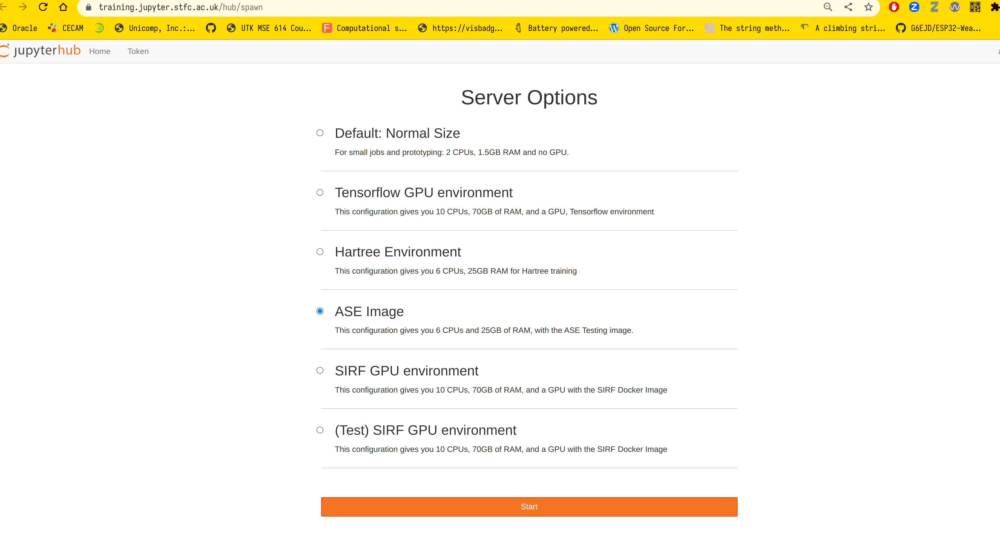

## Introduction to Work Environment

### Access the cloud

We will use STFC cloud environment https://training.jupyter.stfc.ac.uk. It runs a custom baked docker image of Ubuntu Jammy Jellyfish

Use the username given at registration and following instructions to setup your instance.

#### Create account and login

- Go to training.jupyter.stfc.ac.uk into your browser
- Signup: click on **Signup** then use the username given and choose password and click **Create User**

Authorization happens behind the scenes if successful you will see something like.

- Login with the credentials from above

You shall see something like this, if all ok,

#### Stop instance and update

if things go wrong or you need to create an instance with an updated image you need to follow the following steps.

- get the hub settings: File -> Hub Control Panel

- stop the instance

   stop the instance by clicking on the "Stop My Server" button then once stopped you can click Logout.

- start the instance

- choose the instance: (Test) - ASE Image

### Obtain the exercises

open a terminal

~~~
   cd
   git clone xxx WORKSHOP
~~~

a WORKSHOP folder will appear on the left hand side and now you can navigate inside it and find the relevant notebook of the day.

#### Browsers

**Mozilla Firefox** is installed on the machine.

#### Compilers

The **GNU** toolchain is used throughout the summer school and are available at the unix prompt.

* **gcc**: the C/C++ compiler
* **gfortran**: the fortran compiler (it assumes f77 and f95 for ``*``.f and ``*``.f90 respecively). Some of the codes may be in fixed format requiring the compiler flag -ffixed-form.
* **python3** is available on the machine, use python3, be aware that python will give you python2.

#### Plotting Packages

Two graphics packages are available for plotting graphs: **gnuplot** and **xmgrace**. You can also use matplotlib from python.

#### Molecular Graphics Packages

**Jmol, VESTA, AVOGADRO, VMD and xcrysden** is also available. In order to use Jmol type *jmol* on the command line.

#### Editors

There are several editors available. You should choose whichever you are confortable with.

* **vi** the venerable UNIX screen mode editor.
* **vim** the improved venerable UNIX screen mode editor.
* **emacs** probably the commonest full-screen UNIX editor.
* **gedit** gui editor

#### Terminals

When one refers to terminal, console or command line, usually means a shell window. Gnome Terminal, xterm and uxterm are available,
You can click on the terminal icon to get one in the desktop or in the jupyter hub.
