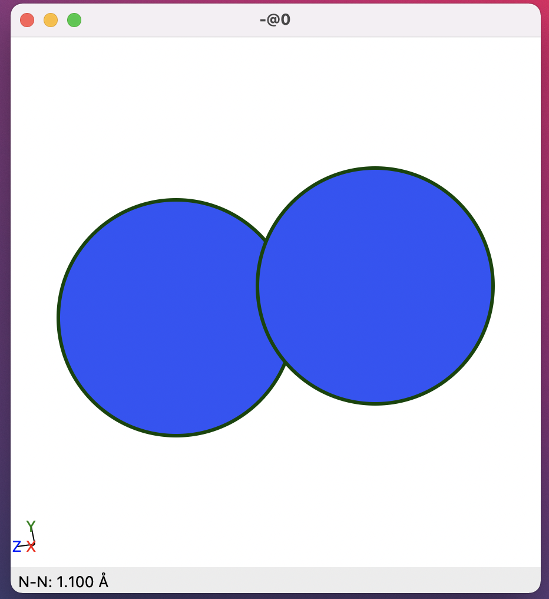
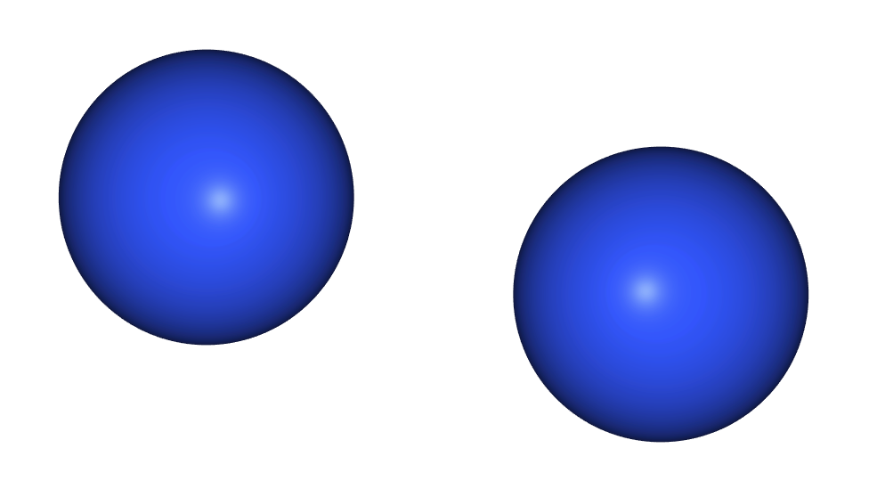
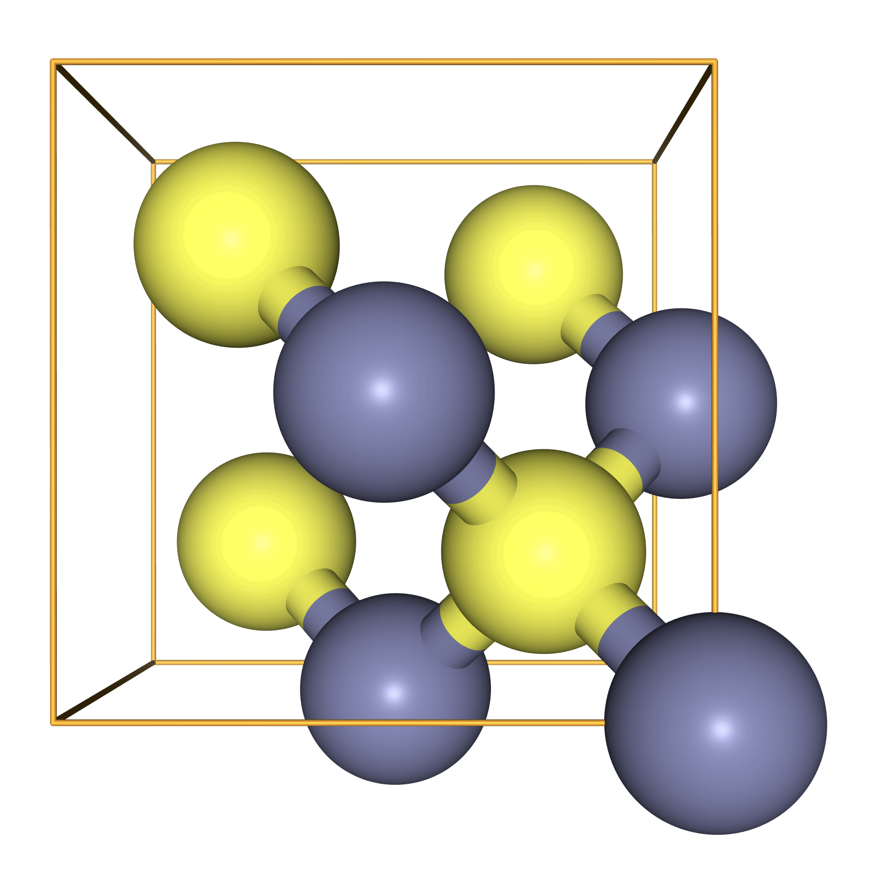

> ## Code connection
> In this chapter we explore the [`Atoms` class](https://wiki.fysik.dtu.dk/ase/ase/atoms.html#list-of-all-methods), which contains methods for getting and setting simple properties for a molecule or material.
{: .callout}

### Molecules and materials are represented by the `Atoms` class

- We can define a molecule with lists of symbols and positions:

~~~
from ase import Atoms

d = 1.10
molecule = Atoms(['N', 'N'], positions=[(0., 0., 0.), (0., 0., d)])
~~~
{: .python}

- For convenience we can compress the list of symbols to a chemical formula:

~~~
molecule = Atoms('N2', positions=[(0., 0., 0.), (0., 0., d)])
~~~
{: .python}

### `ase.visualize.view` and `nglview` can be used to visualise an `Atoms` object

- It can be useful to visualise our structure to make sure it is reasonable.
- `ase.visualize.view` provides a simple structure viewer in a floating window; this is quite useful when working on a Python script, but can be a little bit annoying when using a Jupyter notebook.
- With `ase.visualize.view` you can spin the molecule around with right-click-and-drag, and zoom with mouse wheel.

~~~
from ase.visualize import view
view(molecule,cartoon)
~~~
{: .python}



- Some alternative viewers are available for Jupyter notebooks; here we will use `nglview`.
- `nglview` is able to display trajectories and sequences of structures, a feature which we will use in later tutorials.
- With `nglview` left-click-and-drag is used for rotation.

~~~
import nglview
nglview.show_ase(molecule)
~~~
{: .python}



### To describe crystals we use the `cell` and `pbc` keywords

- Many interesting systems are crystals, described by atomic positions in a periodic unit cell.
- There are two relevant keyword settings for an `Atoms` object: the unit cell itself (`cell`) and the periodic boundary conditions (`pbc`).
- If the cell is specified with three values it is assumed to be cubic.
- In other cases we might use the full 3x3 matrix to describe off-diagonal terms, e.g. ```cell=[[a, -a, 0], [a, a, 0], [0, 0, a]]```
- Once a `cell` is specified we can use the `scaled_positions` keyword to specify atomic positions relative to lattice vectors.
- We set `pbc=True` to indicate periodic boundary conditions in all directions.
- PBCs can also be specified along each direction, e.g. `pbc=[True, True, False]` for a “slab” calculation with exposed surfaces.

> ## Shortcuts
> We have defined a Python function ```show()``` which will show enlarged atoms
> and a unit cell with `nglview`.
> This will save us from writing four lines of code every time we want to display a crystal.
{: .callout}

~~~
a = 5.387
crystal = Atoms('Zn4S4',
                scaled_positions=[[0., 0., 0.],
                           [0., 0.5, 0.5],
                           [0.5, 0., 0.5],
                           [0.5, 0.5, 0.],
                           [0.25, 0.75, 0.75],
                           [0.25, 0.25, 0.25],
                           [0.75, 0.75, 0.25],
                           [0.75, 0.25, 0.75]],
               cell=[a, a, a],
               pbc=True)

def show(atoms: Atoms) -> nglview.widget.NGLWidget:
    view = nglview.show_ase(atoms)
    if any(atoms.pbc):
        view.add_unitcell()
        view.add_ball_and_stick(aspectRatio=6)
    return view

show(crystal)
~~~
{: .python}



### To access information from `Atoms` we use "getter" methods

- Now that we have some Atoms objects we can see what information is available from them.
- To access this information we call some "getter" methods on the `molecule` object we created above.
- Information about the chemical species and atomic positions is provided by us when we create the object.

~~~
print("N2 positions")
print(molecule.get_positions(), end="\n\n")

print("N2 symbols")
print(molecule.get_chemical_symbols(), end="\n\n")
~~~
{: .python}

~~~
N2 positions
[[0.  0.  0. ]
 [0.  0.  1.1]]

N2 symbols
['N', 'N']
~~~
{: .output}

- There is also some information that is retrieved from a database, or derived from these database values.

~~~
print("N2 masses")
print(molecule.get_masses(), end="\n\n")

print("N2 center of mass")
print(molecule.get_center_of_mass())
~~~
{: .python}

~~~
N2 masses
[14.007 14.007]

N2 center of mass
[0.   0.   0.55]
~~~
{: .output}

### We can override default keyword values when we create an `Atoms` object

- When we create an `Atoms` object we can override the default `masses` and include some isotopic effects.
- The center of mass will also be updated accordingly, as this is derived from `masses`.

~~~
d = 1.10
isotope = Atoms('N2',
                positions=[(0., 0., 0.), (0., 0., d)],
                masses=[13.006, 14.003])

print("13N-14N masses")
print(isotope.get_masses(), end="\n\n")

print("13N-14N center of mass")
print(isotope.get_center_of_mass())
~~~
{: .python}

~~~
13N-14N masses
[13.006 14.003]

13N-14N center of mass
[0.         0.         0.57030249]
~~~
{: .output}

### To adjust information in `Atoms` we use "setter" methods

- Once an `Atoms` instance is created we can override the default `masses` using "setter" methods.
- In this example we start by copying the `molecule` object with the default masses.
- We reset the masses using the `set_masses()` method, and the centre of mass is updated automatically.

~~~
isotope = molecule.copy()
print("Center of mass before modifying masses:")
print(isotope.get_center_of_mass(), end='\n\n')

isotope.set_masses([13.006, 14.003])
print("Center of mass after modifying masses:")
print(isotope.get_center_of_mass())
~~~
{: .python}

~~~
Center of mass before modifying masses:
[0.   0.   0.55]

Center of mass after modifying masses:
[0.         0.         0.57030249]
~~~
{: .output}

> ## Accessing help
> In a jupyter notebook we can get the "docstring" of a method or function by adding ? to the name
>
> ~~~
> isotope.get_center_of_mass?
> ~~~
> {: .python}
>
> ~~~
> Signature: isotope.get_center_of_mass(scaled=False)
> Docstring:
> Get the center of mass.
>
> If scaled=True the center of mass in scaled coordinates
> is returned.
> File:      ~/src/ase/ase/atoms.py
> Type:      method
> ~~~
> {: .output}
>
> We can also get access to the available methods and properties with tab-completion. In a Jupyter notebook or IPython terminal, try:
>
> ~~~
> crystal.[TAB]
> ~~~
> { :.python}
> where `[TAB]` means "hit the TAB key". You should see that the `Atoms` object has a lot of features available; however not all of them will work until we start using the `Calculator` class.
{: .callout}

> ## Exercise: Atom features
> Use tab-completion and docstrings to explore the features of `Atoms`. In the
> ZnS structure, find the distance between the first Zn atom and the four S
> atoms. Are some of them nearer than others?
>
> *Hint: you may need to use the "minimum image convention"*
{: .challenge}
