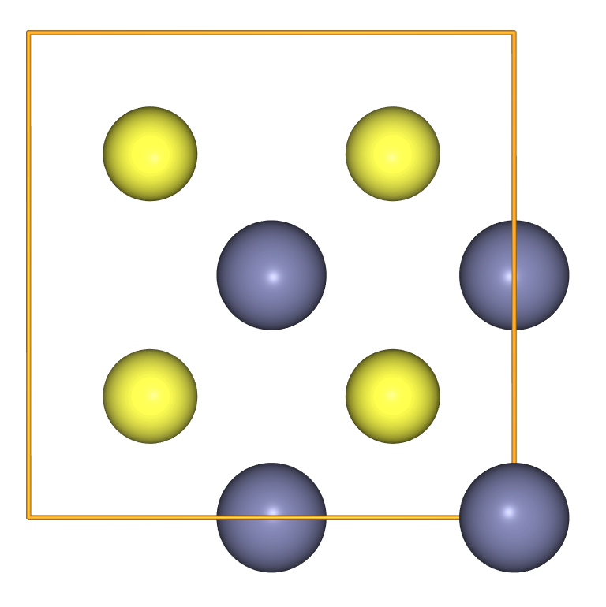

> ## Code connection
> In this episode we explore the [`ase.io` module](https://wiki.fysik.dtu.dk/ase/ase/io/io.html), which contains functions for reading and writing `Atoms` objects.
{: .callout}

### ASE can read a variety of file formats

> ## Downloading structures
> The Materials Project (MP) contains over 150,000 entries.
> To obtain a .cif through a browser window navigate to an entry and use the 
> "export as" button on the structure visualiser. Alternatively, we have uploaded
> a [small selection of MP structures](https://github.com/ASE-Workshop-2023/tutorial/tree/gh-pages/data) which you can download using `wget`. For example, you can run the following command in your Jupyter Notebook to get the `ZnS.cif` file:
> ~~~
> %%bash 
> 
> wget https://raw.githubusercontent.com/ASE-Workshop-2023/tutorial/gh-pages/data/ZnS.cif
> ~~~
> {: .bash}
> 
> There is
> also a [Materials Project Application Programming
> Interface](https://materialsproject.org/api) (API) for accessing structures (and more!)
> programmatically.
{: .callout}

- Even with the shortcuts outlined in the previous tutorial, writing out structures in Python syntax can be a bit cumbersome. 
- There are many established file formats for structural data, and ASE contains read and write functions for some of them.
- In the example below we read in the structure for sphalerite (ZnS) from the Materials Project database; the database entry is [here](https://materialsproject.org/materials/mp-10695).

~~~
import ase.io
from pathlib import Path
from ase.visualize import view

imported_crystal = ase.io.read("./files/ZnS.cif", format='cif')

view(imported_crystal, viewer='ngl')
~~~
{: .python}

- Use the vim terminal text editor (or otherwise) to inspect the .cif file
- Crystallographic Information Framework (CIF) is quite a complicated format because it is designed to hold a lot of data relevant to crystallography. 

~~~
vim "./files/ZnS.cif"
~~~
{: .bash}

### ASE can write a variety of file formats

- We can use ASE to write the ZnS structure in, for example, a `FHI-aims` readable format.
- We don't need to specify the FHI-aims format; the filetype is inferred from the filename.
- The `scaled=True` option is used to write in fractional coordinates; by default this writer uses Cartesian coordinates.

~~~
ase.io.write('geometry.in', imported_crystal, scaled=True)
~~~
{: .python}

- In comparison to .cif, the `FHI-aims` quantum chemistry code has a very simple structure format. 

~~~
cat geometry.in
~~~
{: .sh}

~~~
#=======================================================
# FHI-aims file: geometry.in
# Created using the Atomic Simulation Environment (ASE)
# Wed Apr 12 11:18:21 2023
#=======================================================
lattice_vector 5.3873657499999998 0.0000000000000000 0.0000000000000000 
lattice_vector 0.0000000000000000 5.3873657499999998 0.0000000000000000 
lattice_vector 0.0000000000000000 0.0000000000000000 5.3873657499999998 
atom_frac 0.0000000000000000 0.0000000000000000 0.0000000000000000 Zn
atom_frac 0.5000000000000000 0.5000000000000000 0.0000000000000000 Zn
atom_frac 0.5000000000000000 0.0000000000000000 0.5000000000000000 Zn
atom_frac 0.0000000000000000 0.5000000000000000 0.5000000000000000 Zn
atom_frac 0.2500000000000000 0.2500000000000000 0.2500000000000000 S
atom_frac 0.2500000000000000 0.7500000000000000 0.7500000000000000 S
atom_frac 0.7500000000000000 0.7500000000000000 0.2500000000000000 S
atom_frac 0.7500000000000000 0.2500000000000000 0.7500000000000000 S
~~~
{: .output}

> ## Finding information
> More information about the read and write supported formats can be found [here](https://wiki.fysik.dtu.dk/ase/ase/io/io.html).
> A summary can be produced from the command-line 
> ~~~
> %%bash
> ase info --formats
> ~~~
> {: .bash}
{: .callout}

### There are lots of read and write related functions in modules under `ase.io`

- `ase.io.read()` and `ase.io.write()` will automatically dispatch to a variety of functions in modules under `ase.io`. 
- For example, if we inspect the docstring for `ase.io.write` we can get the signature.

~~~
ase.io.write?
~~~
{: .python}
~~~
ase.io.write(
   filename: Union[str, pathlib.PurePath, IO],
       images: Union[ase.atoms.Atoms, Sequence[ase.atoms.Atoms]],
   format: str = None,
   parallel: bool = True,
   append: bool = False,
   \*\*kwargs: Any,
) -> None
~~~
{: .output}

- `**kwargs` means "all remaining keyword arguments"; this allows extra options like `scaled=True` to be passed to writers that understand them.
- To find the extra supported `**kwargs`, we can look at the documentation of the lower-level functions. 
- For example we can find the `scaled=True` option for FHI-aims [here](https://wiki.fysik.dtu.dk/ase/ase/io/formatoptions.html#ase.io.aims.write_aims).

> ## Exercise: Converting structures
> Import a structure file relevant to your own research, 
> and write it to a different format. See what keywords 
> are available for your favourite formats; for example, 
> VASP users are likely to be interested in using  
> `vasp5=True`.
{: .challenge}

### Some I/O formats support a sequence of atoms 

- This is particularly common for molecular dynamics or geometry optimisation calculation outputs, but they can also be useful to store training data for model-fitting or machine-learning.
- For example, to create a set of similar structures with small random displacements we can use a Python `For` loop and the [`Atoms.rattle` method](https://wiki.fysik.dtu.dk/ase/ase/atoms.html#ase.Atoms.rattle).
- The loop variable `frame` is also used as a seed for the random number generator in `rattle`; if a seed is not provided it defaults to the same default value and the motion over multiple frames is not random.
- The sequence is written using in [`.extxyz` format](https://wiki.fysik.dtu.dk/ase/ase/io/formatoptions.html#extxyz), which is an extension to the very simple xyz format for storing molecular coordinates.

~~~
atoms = imported_crystal

atoms_sequence = []
num_frames = 10

for frame in range(num_frames):
    atoms.rattle(stdev=0.02, seed=frame)  # rattle modifies the atoms in-place
    atoms_sequence.append(atoms.copy())
    
ase.io.write('ZnS_rattle.xyz', atoms_sequence, format='extxyz')
~~~
{: .python}

> ## Discussion
> In this example, why do we need to make a new copy of Atoms in 
> each step of the loop?
{: .discussion}

### List slicing can be used to select a sequence of frames

- By default `ase.io.read()` will only return the last frame of `.extxyz` files as a single `Atoms` object.

~~~
atoms_frame = ase.io.read('ZnS_rattle.xyz')
type(atoms_frame)
~~~
{: .python}

~~~
ase.atoms.Atoms
~~~
{: .output}

- The `index` parameter can be used to select which sequence frames are returned as a list. 
- The `index` keyword supports [Python indexing and slicing operations](https://docs.python.org/3/library/stdtypes.html?highlight=list#common-sequence-operations).
- To get all the frames we can set `index=':'`.

~~~
atoms_all_frames = ase.io.read('ZnS_rattle.xyz', index=':')
print(type(atoms_all_frames))
print(len(atoms_all_frames))
~~~
{: .python}

~~~
list
10
~~~
{: .output}

- Alternatively, we can slice to get, for example, every other frame.

~~~
atoms_alternating = ase.io.read('ZnS_rattle.xyz', index='::2')
print(type(atoms_all_frames))
print(len(atoms_all_frames))
~~~
{: .python}

~~~
<class 'list'>
5
~~~
{: .output}

> ## From the horse's mouth
> You can read about the `index` parameter and more by inspecting the [documentation of this function](https://wiki.fysik.dtu.dk/ase/ase/io/io.html#ase.io.read).
{: .callout}

### To visualise a sequence of frames use the ASE GUI or write an animation

- The ASE `view` function has some basic features to animate a list of `Atoms`.
- Try playing with the "movie" controls after running the code below.

~~~
view(atoms_alternating, viewer='ngl')
~~~
{: .python}

- Some image formats are also supported by `ase.io.write`. 
- For example, it is straight forward to generate an animated GIF.

~~~
ase.io.write('rattle.gif', atoms_sequence)
~~~
{: .python}
