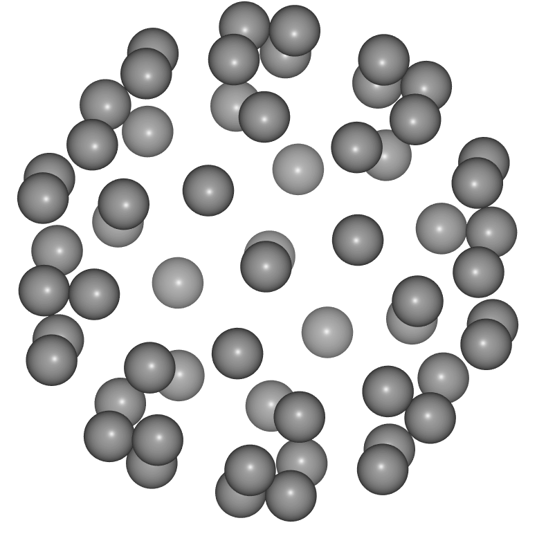
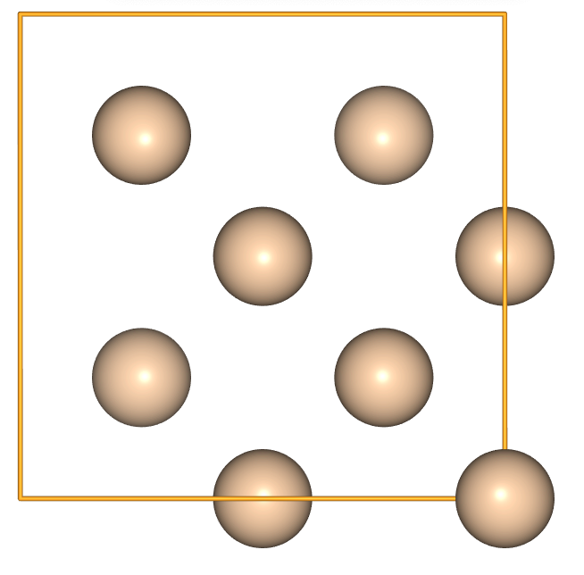
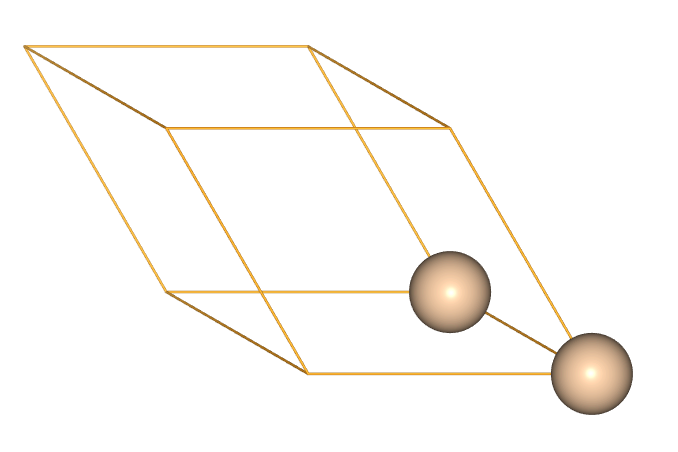
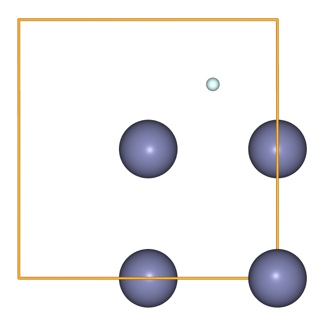
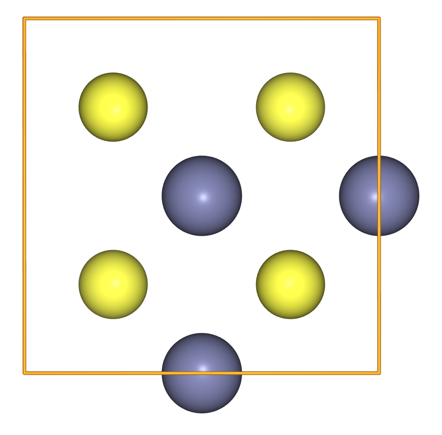
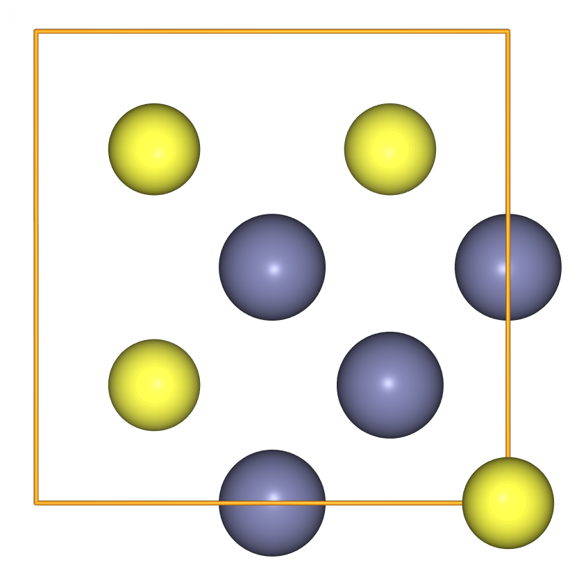

> ## Code connection
> In this chapter we explore the [`ase.build` module](https://wiki.fysik.dtu.dk/ase/ase/build/build.html), which contains tools for building structures using parameters rather than detailed lists of positions.
{: .callout}

### A set of simple molecules are pre-defined in ASE

- Definitions for a set of simple molecules (the ["G2" set](https://wiki.fysik.dtu.dk/ase/ase/collections.html#g2-neutral-test-set-of-molecules) and the ["S22" set](https://wiki.fysik.dtu.dk/ase/ase/collections.html#ase.collections.s22)) are included with ASE. 
- So in fact the easiest way to get an N2 molecule is with [`ase.build.molecule`](https://wiki.fysik.dtu.dk/ase/ase/build/build.html#ase.build.molecule).

~~~
import ase.build
g2_n2 = ase.build.molecule('N2')
show(g2_n2)
~~~
{: .python}

- If we inspect the type of `g2_n2` we see that it is an `Atoms` object, just like that we created manually in earlier chapters.

~~~
type(g2_n2)
~~~
{: .python}

~~~
ase.atoms.Atoms
~~~
{: .output}

- And it's just as easy to get more interesting things like a buckyball! 

~~~
show(ase.build.molecule('C60'))
~~~
{: .python}

### There are pre-defined lattice parameters and crystal types to create bulk systems

- The equivalent tool to build crystals is [`ase.build.bulk`](https://wiki.fysik.dtu.dk/ase/ase/build/build.html#common-bulk-crystals). 
- This includes lattice parameters for some elemental reference states; the list is [in the code here](https://gitlab.com/ase/ase/-/blob/6ac638d0c699f7bc80c10a8dccb7d42eda011be2/ase/data/__init__.py#L578).
- So we get copper, for example, with very little work:

~~~
show(ase.build.bulk('Cu', cubic=True))
~~~
{: .python}

- To create ZnS in the zincblende structure we have to provide the `crystalstructure` and the lattice parameter `a`.

~~~
show(
    ase.build.bulk('ZnS',
                   crystalstructure='zincblende',
                   a=5.387,
                   cubic=True)
)
~~~
{: .python}

### A compact notation can be used to create a supercell

- Supercell expansions of a unit cell are commonly used when modelling, for example, lattice dynamics or defect systems.
- A compact notation can be used to create the repeated unit cell. 
- Start by creating a cubic unit cell of Si.

~~~
si = ase.build.bulk('Si', cubic=True)
show(si)
~~~
{: .python}

- Use integer multiplication to perform equal repetition in each direction:

~~~
show(si * 4)
~~~
{: .python}

- Use a 3-list or 3-tuple to perform unequal repetitions in each direction:

~~~
show(si * [2, 4, 1])
~~~
{: .python}

### Cell parameters can be inspected using the `Atoms.cell` attribute

- When we model dilute defects it can be useful to use cubic supercell expansions, as these will maximise the minimum distance between periodic images.
- Our starting point for this is often a non-cubic _primitive_ cell.

~~~
si_prime = ase.build.bulk('Si')
show(si_prime)
~~~
{: .python}

- We can inspect the cell parameters using the `Atoms.cell` attribute.

~~~
si_prime.cell
~~~
{: .python}

~~~
Cell([[0.0, 2.715, 2.715], [2.715, 0.0, 2.715], [2.715, 2.715, 0.0]])
~~~
{: .output}

- We find that `Atoms.cell` returns an instance of the ASE `Cell` class.
- The `Cell` object represents three lattice vectors forming a parallel epiped.

### ASE can search for the matrix which gives the most cubic supercell

- Once we have a primitive cell, we can perform a numerical search to find the optimal 3x3 array for forming the most cubic supercell; this process may take a few seconds.
- We specify three positional arguments: unit cell parameters, the target size of the supercell, and the target shape. For more information, you can inspect the docstring.

~~~
optimal_array = ase.build.find_optimal_cell_shape(si_prim.cell, 4, 'sc', verbose=True)
~~~
{: .python}

~~~
target metric (h_target):
[[1. 0. 0.]
 [0. 1. 0.]
 [0. 0. 1.]]
normalization factor (Q): 0.184162
idealized transformation matrix:
[[-1.  1.  1.]
 [ 1. -1.  1.]
 [ 1.  1. -1.]]
closest integer transformation matrix (P_0):
[[-1  1  1]
 [ 1 -1  1]
 [ 1  1 -1]]
smallest score (|Q P h_p - h_target|_2): 0.000000
optimal transformation matrix (P_opt):
[[-1  1  1]
 [ 1 -1  1]
 [ 1  1 -1]]
supercell metric:
[[5.43 0.   0.  ]
 [0.   5.43 0.  ]
 [0.   0.   5.43]]
determinant of optimal transformation matrix: 4
~~~
{: .output}

- We can then pass the 3x3 array to `ase.build.make_supercell` to form a cubic supercell.

~~~
cubic_Si_expansion = ase.build.make_supercell(si_prim, optimal_array)
show(cubic_Si_expansion)
~~~

~~~
cubic_Si_expansion.cell
~~~
{: .python}

~~~
Cell([5.43, 5.43, 5.43])
~~~
{: .output}

- We find that, as expected, this is equal to the Si cubic crystal structure pre-defined in ASE.

~~~
si = ase.build.bulk('Si', cubic=True)
si.cell
~~~

~~~
Cell([5.43, 5.43, 5.43])
~~~
{: .output}

### An Atoms object can be treated as an array of Atom objects

- An `Atoms` object can be treated as a list of `Atom` objects which we can iterate over.
- `Atom` is a class for representing....you guessed it...a single atom.

~~~
crystal = ase.build.bulk('ZnS',
                   crystalstructure='zincblende',
                   a=5.387,
                   cubic=True)

for atom in crystal:
    print(atom.symbol, atom.position, atom.mass)
~~~
{: .python}

~~~
Zn [0. 0. 0.] 65.38
S [1.34675 1.34675 1.34675] 32.06
Zn [0.     2.6935 2.6935] 65.38
S [1.34675 4.04025 4.04025] 32.06
Zn [2.6935 0.     2.6935] 65.38
S [4.04025 1.34675 4.04025] 32.06
Zn [2.6935 2.6935 0.    ] 65.38
S [4.04025 4.04025 1.34675] 32.06
~~~
{: .output}

- Numpy-like array indexing and slicing is also available.
- For example, we can combine indexing with list comprehension to return the zinc sub-lattice.

~~~
zinc_indices = [i for i, atom in enumerate(crystal) if atom.symbol == 'Zn']
zinc_sublattice = crystal[zinc_indices]
show(zinc_sublattice)
~~~
{: .python}

- When we index multiple atoms, an `Atoms` object is returned.

~~~
type(zinc_sublattice)
~~~
{: .python}

~~~
ase.atoms.Atoms
~~~
{: .output}

### Methods and operations can be used to create point defects

- An individual `Atom` can be appended to create an interstitial defect.

~~~
from ase import Atom
composite = zinc_sublattice.copy()
composite.append(Atom('He', position=(1.34675, 4.04025, 4.04025)))
show(composite)
~~~
{: .python}

- While `Atoms` is not exactly a regular Python object, it plays nicely with the delete operation. 
- We can use this operation to create, for example, a zinc-vacancy defect:

~~~
zinc_vacancy = crystal.copy()
del zinc_vacancy[0]
show(zinc_vacancy)
~~~
{: .python}

- To create antisite disorder, we can swap two positions from the positions array.

~~~
antisite = crystal.copy()
antisite.positions[[0, 1]] = antisite.positions[[1, 0]]
show(antisite)
~~~
{: .python}

> ## Exercise: Distorted sphalerite
> It is possible to combine entire `Atoms` with `+`. In this case, the first `Atoms` takes precedence to determine the cell parameters. 
> Use this to create a distorted sphalerite cell, with the S sublattice translated along the x-coordinate relative to the Zn sublattice
>
> > ## Solution
> >
> > ~~~
> > sulfur_sublattice = [i for i, atom in enumerate(crystal) if atom.symbol == 'S']
> > sulfur_sublattice.translate([.3, 0., 0.])
> > show(zinc_sublattice + sulfur_sublattice)
> > ~~~
> > {: .python}
> {: .solution}
{: .challenge}

> ## Exercise: Water animation
> Create an animation of a 
> water molecule being wrapped in 
> a C60 cage (or something even 
> cooler!)
> 
> Hints:
> - The GIF animation will need to be generated with a list of Atoms objects
> - Molecules can be combined with +
> - To get the wrapping effect we need to keep adding atoms that are near to the atoms already added
> - To avoid writing too much repetitive code, use Python's looping tools
> 
> > ## Solution
> > 
> > ~~~
> > water = ase.build.molecule('H2O')
> > water.center()
> > 
> > bucky = ase.build.molecule('C60')
> > bucky.center()
> > 
> > start_atom = 36
> > distances = bucky.get_all_distances()[start_atom]
> > sorted_bucky_indices = sorted(enumerate(distances),
> >                               key = (lambda x: x[1]))
> > sorted_bucky_indices = [i for i, _ in sorted_bucky_indices]
> > sorted_bucky = bucky[sorted_bucky_indices]
> > 
> > frames = [water.copy()]
> > 
> > for i in range(len(sorted_bucky)):
> >     frames.append(water + sorted_bucky[:i + 1])
> > 
> > from ase.io.animation import write_gif
> > _ = write_gif('wrapped_molecule.gif', frames)
> > ~~~
> > {: .python}
> {: .solution}
{: .challenge}

