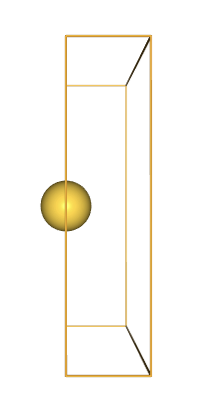
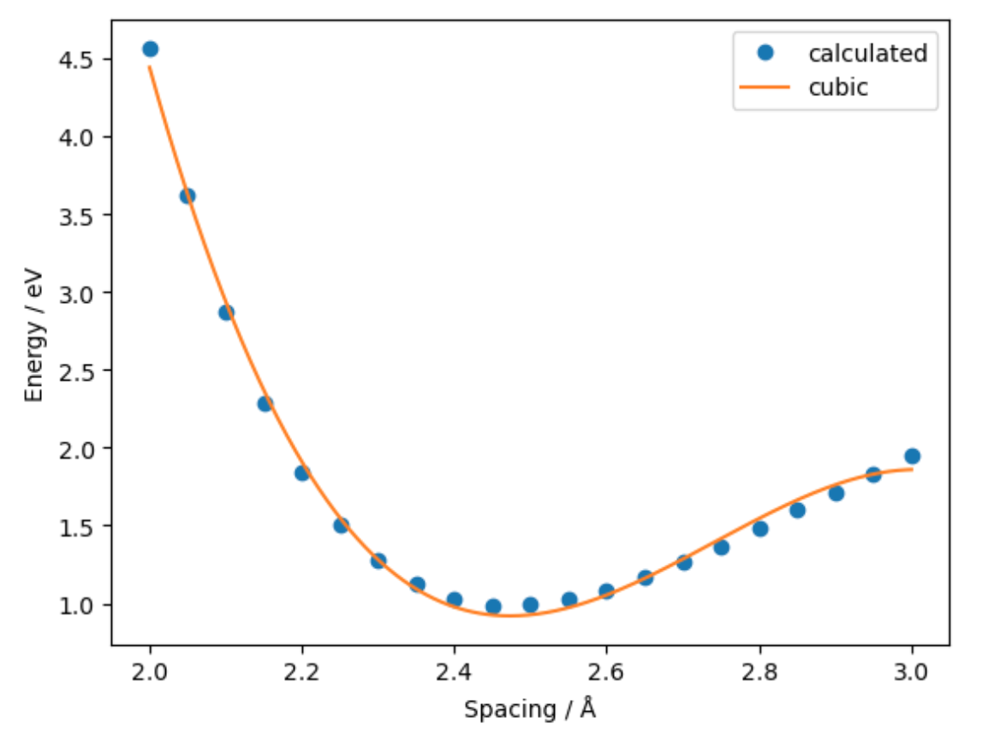

> ## Code connection
> In this chapter we explore the [`ase.calculatorse.emt` module](https://wiki.fysik.dtu.dk/ase/ase/calculators/emt.html#module-ase.calculators.emt) and [`ase.calculatorse.lj` module](https://wiki.fysik.dtu.dk/ase/ase/calculators/others.html#module-ase.calculators.lj), both of which provide built-in tools for calculating standard properties (energy, forces and stress) from a set of atomic positions.
{: .callout}

### Atoms objects can calculate properties using an attached "Calculator"

- In ASE, `Atoms` objects can try to calculate or fetch properties using an attached `Calculator`.
- In this tutorial we will make tour of a variety of Calculators, highlighting some of the differences between them. 
- A master list of the available Calculators can be found [here](https://wiki.fysik.dtu.dk/ase/ase/calculators/calculators.html).

### Properties of metal alloy systems can be calculated using Effective Medium Theory

> ## Warning
> If you want to do a real application using EMT, you should used the much more efficient implementation in the [ASAP calculator](https://wiki.fysik.dtu.dk/asap).
{: .callout}

- Much of the ASE documentation and tutorials makes use of the [built-in "EMT" calculator](https://wiki.fysik.dtu.dk/ase/ase/calculators/emt.html#pure-python-emt-calculator)
- This is because it is convenient and "fast enough"
- EMT implements the Effective Medium Theory potential for Ni, Cu, Pd, Ag, Pt and Au. 
- Some other elements are included "for fun", but really this is a method for alloys of those metals. 

### Calculators can calculate properties in three easy steps

- EMT can be used to calculate, for example, the energy of an infinite gold wire.
- The first step is to create an `Atoms` object describing a gold wire which is infinite in the x-direction.

> ## Python tip
> You may not recognise or understand the syntax used in the function definition, for example
> `spacing: float = 2.5`. These are optional [Type Hints](https://peps.python.org/pep-0484/
), and the syntax for this was defined relatively recently. 
{: .callout}

~~~
from ase import Atoms
from ase.calculators.emt import EMT

def make_wire(spacing: float = 2.5,
              box_size: float = 10.0) -> Atoms:

    wire = Atoms('Au',
                 positions=[[0., box_size / 2, box_size / 2]],
                 cell=[spacing, box_size, box_size],
                 pbc=[True, False, False])
    return wire

atoms = make_wire()
show(atoms)
~~~

- The second step is to attach the calculator of choice, in this case `EMT()`

~~~
atoms.calc = EMT()
~~~

- The third and final step is to call a "getter" method for the property of choice, in this case the potential energy.

~~~
energy = atoms.get_potential_energy()
print(f"Energy: {energy} eV")
~~~
{: .python}

~~~
Energy: 0.9910548478768826 eV
~~~
{: .output}

> ## Discussion
> Why did we need the parentheses () in the line `atoms.calc = EMT()`?
{: .discussion}

### Scientific Python libraries allow us to fit models to our calculations

- We can use the workflow above to investigate how energy varies with the atom spacing and fit a model.
- First we wrap the workflow up within a single function which returns the energy for a given atom spacing.

> ## Python tip
> if you need to apply a function to each element of some data, `map` can provide an elegant alternative to for-loops and list comprehensions!
{: .callout}

~~~
import numpy as np
distances = np.linspace(2., 3., 21)

def get_energy(spacing: float) -> float:
    atoms = make_wire(spacing=spacing)
    atoms.calc = EMT()
    return atoms.get_potential_energy()

energies = list(map(get_energy, distances))
~~~
{: .python}

- Second we use Numpy to fit a polynomial to the generated data

~~~
from numpy.polynomial import Polynomial
fit = Polynomial.fit(distances, energies, 3)
~~~
{: .python}

- Finally we use Matplotlib to visualise the data and fit

~~~
%matplotlib inline

import matplotlib.pyplot as plt
fig, ax = plt.subplots()
x = np.linspace(2., 3., 500)

_ = ax.plot(distances, energies, 'o', label='calculated')
_ = ax.plot(x, fit(x), '-', label='cubic')
_ = ax.legend()
_ = ax.set_xlabel('Spacing / Å')
_ = ax.set_ylabel('Energy / eV')
~~~
{: .python}

> ## Exercise: Equation of State for bulk gold
> The plot above resembles the Equation-of-State (EOS) curve for a solid. 
> Using a similar workflow and [`EquationOfState`](https://wiki.fysik.dtu.dk/ase/ase/eos.html) class, fit an equation of state to bulk gold and obtain an equilibrium volume.
{: .challenge}

### The EMT Calculator can also be used to obtain forces and unit cell stress

~~~
print("Forces: ")
print(atoms.get_forces())

print("Stress: ")
print(atoms.get_stress())
~~~
{: .python}

~~~
Forces: 
[[0. 0. 0.]]
Stress: 
[ 0.00396458 -0.         -0.         -0.         -0.         -0.        ]
~~~
{: .output}

> ## Discussion
> Why are the forces exactly zero for this system?
{: .discussion}

- We can check which properties are implemented by a particular calculator by inspecting the `implemented properties` attribute:

~~~
print(EMT.implemented_properties)
~~~
{: .python}

~~~
['energy', 'free_energy', 'energies', 'forces', 'stress', 'magmom', 'magmoms']
~~~
{: .output}

> ## Discussion
> Why do we *not* need to include parenthesis () here? Do we expect `EMT().implemented_properties` to work as well as `EMT.implemented_properties`?
{: .discussion}

### Where possible request a standalone set of property data

- It is sometimes convenient to have properties attached to a particular `Calculator` object.
- For example, forces are used heavily by dynamics and optimizer routines, as we will see in the next tutorial.
- However for Open Science purposes it is easier to store and share data that is not connected to a `Calculator`. This is because Calculators might depend on a particular machine environment, memory state or software license. 
- We can request a standalone set of property data with `get_properties`.

~~~
properties = atoms.get_properties(['energy', 'forces', 'stress'])
print(properties)
~~~
{: .python}

~~~
(Properties({'energy': 0.9910548478768826, 'natoms': 1, 'energies': array([0.99105485]), 'free_energy': 0.9910548478768826, 'forces': array([[0., 0., 0.]]), 'stress': array([ 0.00396458, -0.        , -0.        , -0.        , -0.        ,
       -0.        ])})
~~~
{: .output}

- Importantly, this will not change even if the `Atoms` object is modified and properties are recalculated.

> ## Warning
> This is a new feature and does not yet work well for all calculators.
{: .callout}

### The Lennard-Jones potential can be used to model the interaction between two non-bonding atoms or molecules

- The classic [Lennard-Jones potential](https://en.wikipedia.org/wiki/Lennard-Jones_potential) is implemented in `ase.calculators.lj`. 
- You can set the $\epsilon$ and $\sigma$ parameters in the Calculator constructor:

~~~
from ase.calculators.lj import LennardJones

l = 4.1
atoms = Atoms('Xe2',
              positions=[[0., 0., -l / 2],
                         [0., 0., l / 2]],
              pbc=False)
atoms.calc = LennardJones(sigma=(4.1 / 2**(1/6)))

atoms.get_forces()
~~~
{: .python}

~~~

array([[ 0.00000000e+00,  0.00000000e+00, -6.49886649e-16],
       [ 0.00000000e+00,  0.00000000e+00,  6.49886649e-16]])
~~~
{: .output}

> ## Discussion
> Why are the forces so low at this geometry?
{: .discussion}

> ## Exercise: Lennard-Jones binding curve
> Try varying the distance between the atoms. Can you reproduce the classic plot of a Lennard-Jones binding curve?
{: .challenge}

