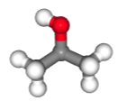

> ## Code connection
> In this chapter we explore the [`ase.calculators.mopac` module](https://databases.fysik.dtu.dk/ase/ase/calculators/mopac.html), which is a file-based calculator for calculating standard properties (energy, forces and stress) from a set of atomic positions.
{: .callout}

### Typical academic codes are controlled by _input files_ and write their results to _output files_

- This workflow is convenient for batch calculations on clusters (and for Fortran programmers...)
- To interoperate with this type of code, the ASE Calculator needs to: i) prepare appropriate input; ii) call the executable; iii) read the output
- This will allow us to build a similar workflow to the built-in Calculators explored in the previous chapter.

### The workflow for file-based and built-in calculators are the same

- The file-based calculator [MOPAC](https://openmopac.github.io) implements semi-empirical methods with molecular orbitals in open boundary conditions. 
- After a long history of versions and licenses it was recently updated and made open-source under the LGPL.
- To calculate a system energy we use the same workflow as introduced in the previous chapter.
- First, we build an `Atoms` object

~~~
import ase.build
atoms = ase.build.molecule('C2H6CHOH')
show(atoms)
~~~
{: .python}

- Second, we attach a calculator: in this case, MOPAC.

~~~
from ase.calculators.mopac import MOPAC
atoms.calc = MOPAC(label='isopropyl-alcohol')
~~~
{: .python}

- Third, we calculate an energy.

~~~
print("Energy: ", atoms.get_potential_energy())
~~~
{: .python}

~~~
MOPAC Job: "isopropyl-alcohol.mop" ended normally on Apr  3, 2023, at 21:29.

Energy:  -2.7842547352472047
~~~
{: .output}

- As part of this process some data was also written to the Calculator `results`.

~~~
atoms.calc.results
~~~
{: .python}

~~~
{'version': 'v22.0.6',
 'final_hof': -2.7842547352472047,
 'total_energy': -772.22396,
 'forces': array([[ 0.09452837, -0.58935651,  0.32936589],
        [-0.08600234,  0.14274349,  0.18579394],
        [ 0.07639485,  0.31559567, -0.11416446],
        [ 0.04624326,  0.38071862,  0.42829993],
        [-0.0548457 , -0.0925792 , -0.20465619],
        [ 0.1883473 ,  0.10008969, -0.12176805],
        [-0.20786882, -0.0372329 , -0.15859723],
        [ 0.15218576, -0.10221587, -0.13990335],
        [-0.20513693,  0.04222415, -0.04563994],
        [ 0.06881428, -0.05719803, -0.06499095],
        [-0.10723496, -0.05249259, -0.0346418 ],
        [ 0.03457494, -0.05029646, -0.05909764]]),
 'dipole': array([ 0.23963168, -0.26607236,  0.20049114]),
 'energy': -2.7842547352472047,
 'free_energy': -2.7842547352472047}
~~~
{: .output}

> ## Note
> MOPAC is one of the calculators that doesn't support get_properties() yet... We can still get a nice results container this way, though!
{: .callout}

### However behind the scenes, file-based calculators work differently

- When we requested the potential energy, the Calculator generated an input file using the name we provided as *label*: "ispropyl-alcohol.mop". 
- This is a human-readable file: you can take a look at it.

~~~
cat ispropyl-alcohol.mop
~~~

- The top line includes some parameters for the calculation, including selection of the PM7 semi-empirical method and convergence tolerance.
- Below that are the atomic positions.
- After writing the input, the calculation is run by calling the `mopac` executable.
- The results were written to "isopropyl-alcohol.out"; this is another human-readable file.

> ## Exercise: Calculating energy and forces
> Can you find the energy and forces in this file? Do they agree with the values from ASE?
>
> Hint: ASE mostly uses units related to eV and Ångström
{: .challenge}

### The Calculator object caches calculation results

- This means we can mostly use the property getters without worrying about wastefully running unnecessary calculations.
- For example, we can request the forces and receive them instantly as no new calculation is required.
- The forces were already present they are simply retrieved from the cache.

~~~
print(atoms.get_forces())
~~~
{: .python}

~~~
[[ 0.09452837 -0.58935651  0.32936589]
 [-0.08600234  0.14274349  0.18579394]
 [ 0.07639485  0.31559567 -0.11416446]
 [ 0.04624326  0.38071862  0.42829993]
 [-0.0548457  -0.0925792  -0.20465619]
 [ 0.1883473   0.10008969 -0.12176805]
 [-0.20786882 -0.0372329  -0.15859723]
 [ 0.15218576 -0.10221587 -0.13990335]
 [-0.20513693  0.04222415 -0.04563994]
 [ 0.06881428 -0.05719803 -0.06499095]
 [-0.10723496 -0.05249259 -0.0346418 ]
 [ 0.03457494 -0.05029646 -0.05909764]]
~~~
{: .output}

### After changing a parameter the cache is invalidated

- For example, we can select the AM1 semi-empirical scheme for the calculation.
- Now when the potential energy is requested, a new calculation is performed.

~~~
atoms.calc.set(method='AM1')
atoms.get_potential_energy()
~~~
{: .python}

~~~
MOPAC Job: "isopropyl-alcohol.mop" ended normally on Apr  3, 2023, at 21:29.

-2.8723671252448977
~~~
{: .output}

> ## Discussion
> What happens to calc.results when a parameter is changed? When might we prefer to use `atoms.get_forces()` vs `atoms.calc.results['forces']`?
{: .discussion}
