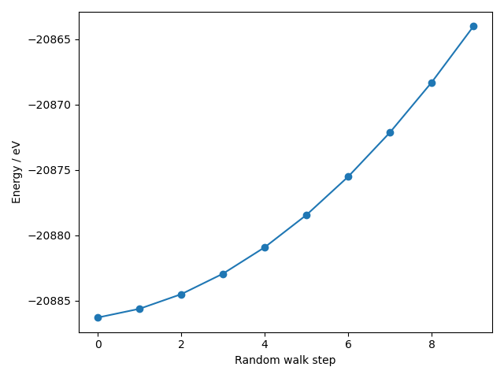

> ## Code connection
> In this episode we explore two external calculators: [Quippy](http://libatoms.github.io/QUIP/), which provides an interface to a range of interatomic and tight-binding potentials, including [Gaussian Approximation Potentials](https://libatoms.github.io/GAP/), and Socket calculations using the electronic structure code [Quantum Espresso](https://www.quantum-espresso.org/).
{: .callout}

### The `quippy` package provides a Python interface to a range of interatomic and tight-binding potentials

- Some calculators have interfaces which are not packaged with ASE, but available elsewhere.
- For example, the `quippy` package provides a Python interface to a range of interatomic and tight-binding potentials.
- In this episode we apply a machine-learning-based potential for Si.

> ## Getting the model and training data
> The documentation for Gaussian Approximation Potentials (GAP) links to a [few published GAP models](https://libatoms.github.io/GAP/data.html).
> To download and extract the data in a Jupyter notebook you can use bash.
> ~~~
> %%bash
>
> wget -q https://www.repository.cam.ac.uk/bitstream/handle/1810/317974/Si_PRX_GAP.zip
> unzip Si_PRX_GAP.zip -d ./Si_PRX_GAP
> ~~~
> {: .bash}
>
{: .callout}

> ## Note
> This requires a version of quippy that includes GAP. At the moment, `pip install` seems to work better than installing from conda-forge.
{: .callout}

### The workflow for external, file-based and built-in calculators is the same

- First, we import libraries and create an `Atoms` object; in this case, a silicon supercell.

~~~
from quippy.potential import Potential
si = ase.build.bulk('Si') * 4
~~~
{: .python}

- Second we attach a calculator, in this case a `Potential` object imported from `quippy`.
~~~
si.calc = Potential(param_filename='./Si_PRX_GAP/gp_iter6_sparse9k.xml')
~~~
{: .python}

- Third, we calculate an energy; in this case we place this in a `for` loop and apply a random walk to the positions.

~~~
import matplotlib.pyplot as plt

energies = []
for _ in range(10):
    si.rattle(stdev=0.01)
    energies.append(si.get_potential_energy())

fig, ax = plt.subplots()
ax.plot(energies, 'o-')
ax.set_xlabel('Random walk step')
ax.set_ylabel('Energy / eV')
~~~
{: .python}

- This is a bit more expensive than EMT but still a lot cheaper than density-functional theory!
- A lot of work goes into developing a new potential, but with tools like quippy and ASE it is fairly easy for researchers to pick up the resulting model and apply it.

### "GPAW is a package for electronic structure calculations which relies on ASE"

- GPAW is an electronic structure code implemented as a Python library with C backend.
- GPAW includes a few command line tools, but is generally always used with ASE.
- Due to this close relationship many GPAW developers are also ASE developers.
- GPAW implements the [projector-augmented wave (PAW)](https://wiki.fysik.dtu.dk/gpaw/documentation/introduction_to_paw.html) method which requires atomic "setups" with pseudopotentials.

> ## Getting the data
> To download the necessary pseudopotential data, run `gpaw install-data ./gpaw-pot/` in the terminal and type `y` when prompted`.
{: .callout} 

### Performing a DFT calculation from the Python shell

- To begin with, we run a single-point energy calculation using Kohn-Sham density-functional theory (DFT).
- First, we import GPAW and create the atoms object

~~~
from gpaw import GPAW, PW

atoms = ase.build.bulk('Cu')
~~~
{: .python}

- Second, we attach GPAW as a calculator
- We specify a number of parameters:
    - `xc` sets the exchange-correlation functional
    - `kpts` sets the Brillouin-zone sampling
    - `mode` sets the basis set; in this case a 400 eV cutoff plane-wave basis is used.
- For more information about valid parameters, [see the GPAW docs](https://wiki.fysik.dtu.dk/gpaw/documentation/basic.html#parameters).
~~~
atoms.calc = GPAW(xc='PBE', kpts=(3, 3, 3), mode=PW(400))
~~~

- Finally, we run the calculation and get the result

~~~
energy = atoms.get_potential_energy()
~~~
{: .python}

~~~

  ___ ___ ___ _ _ _  
 |   |   |_  | | | | 
 | | | | | . | | | | 
 |__ |  _|___|_____|  22.8.0
 |___|_|             

User:   adam@Arctopus
Date:   Tue Apr  4 11:30:25 2023
Arch:   x86_64
Pid:    97252
CWD:    /home/adam/src/ase-tutorial-2023/development
Python: 3.10.0
gpaw:   /home/adam/.conda/envs/user-base/envs/ase-tutorials/lib/python3.10/site-packages/gpaw
_gpaw:  /home/adam/.conda/envs/user-base/envs/ase-tutorials/lib/python3.10/site-packages/
        _gpaw.cpython-310-x86_64-linux-gnu.so
ase:    /home/adam/src/ase/ase (version 3.23.0b1-70eab133b6)
numpy:  /home/adam/.conda/envs/user-base/envs/ase-tutorials/lib/python3.10/site-packages/numpy (version 1.23.5)
scipy:  /home/adam/.conda/envs/user-base/envs/ase-tutorials/lib/python3.10/site-packages/scipy (version 1.10.1)
libxc:  5.2.3
units:  Angstrom and eV
cores: 1
OpenMP: True
OMP_NUM_THREADS: 1

Input parameters:
  kpts: [3 3 3]
  mode: {ecut: 400.0,
         name: pw}
  xc: PBE

System changes: positions, numbers, cell, pbc, initial_charges, initial_magmoms 

Initialize ...
~~~
{: .output}

### It is important to check for convergence of the energy with respect to k-point sampling

- Using a `for` loop we can re-run the calculation for a increasing k-point mesh densities.
    - In this case we pass a dictionary specification that generates a mesh that is shifted off the Gamma-point.
    - We also use the `txt` keyword to direct output to a text file.
- We collect timing information to understand how increasing mesh density impacts calculation cost. 
    - The argument `str(k)` is the timer name
- The number of k-points is retrieved with `get_ibz_k_points()`. Note that `get_bz_k_points()` is not the correct function to use as this does not include reductions made due to system symmetry.

> ## Note
> This will take a few minutes to run: to see live output, open a terminal and use `tail -f kpts_serial.txt` to see this file grow. When it is finished, you can exit `tail` with ctrl-c.
{: .callout}

~~~
from ase.utils.timing import Timer

timer = Timer()
energies, times, nkpts = [], [], []

for k in range(3,9):

    atoms.calc = GPAW(mode=PW(400), xc='PBE',
                      kpts={'size': [k, k, k],
                            'gamma': False},
                      txt='kpts_serial.txt')
    timer.start(str(k))
    energies.append(atoms.get_potential_energy())
    timer.stop(str(k))
    times.append(timer.get_time(str(k)))
    nkpts.append(len(atoms.calc.get_ibz_k_points()))
~~~
{: .python}

~~~
Timing:                              incl.     excl.
-----------------------------------------------------------
Hamiltonian:                         0.096     0.000   0.0% |
 Atomic:                             0.088     0.001   0.0% |
  XC Correction:                     0.087     0.087   0.8% |
 Calculate atomic Hamiltonians:      0.001     0.001   0.0% |
 Communicate:                        0.000     0.000   0.0% |
 Initialize Hamiltonian:             0.000     0.000   0.0% |
 Poisson:                            0.000     0.000   0.0% |
 XC 3D grid:                         0.007     0.007   0.1% |
LCAO initialization:                 0.344     0.082   0.7% |
 LCAO eigensolver:                   0.147     0.000   0.0% |
  Calculate projections:             0.000     0.000   0.0% |
  DenseAtomicCorrection:             0.000     0.000   0.0% |
  Distribute overlap matrix:         0.000     0.000   0.0% |
  Orbital Layouts:                   0.001     0.001   0.0% |
  Potential matrix:                  0.144     0.144   1.3% ||
  Sum over cells:                    0.001     0.001   0.0% |
 LCAO to grid:                       0.018     0.018   0.2% |
 Set positions (LCAO WFS):           0.097     0.012   0.1% |
  Basic WFS set positions:           0.002     0.002   0.0% |
  Basis functions set positions:     0.000     0.000   0.0% |
  P tci:                             0.014     0.014   0.1% |
  ST tci:                            0.039     0.039   0.3% |
  mktci:                             0.030     0.030   0.3% |
PWDescriptor:                        0.017     0.017   0.2% |
SCF-cycle:                           1.907     0.101   0.9% |
 Davidson:                           0.459     0.152   1.3% ||
  Apply H:                           0.033     0.027   0.2% |
   HMM T:                            0.006     0.006   0.1% |
  Subspace diag:                     0.076     0.004   0.0% |
   calc_h_matrix:                    0.056     0.023   0.2% |
    Apply H:                         0.034     0.027   0.2% |
     HMM T:                          0.006     0.006   0.1% |
   diagonalize:                      0.009     0.009   0.1% |
   rotate_psi:                       0.006     0.006   0.1% |
  calc. matrices:                    0.160     0.091   0.8% |
   Apply H:                          0.069     0.056   0.5% |
    HMM T:                           0.012     0.012   0.1% |
  diagonalize:                       0.023     0.023   0.2% |
  rotate_psi:                        0.014     0.014   0.1% |
 Density:                            0.191     0.000   0.0% |
  Atomic density matrices:           0.019     0.019   0.2% |
  Mix:                               0.064     0.064   0.6% |
  Multipole moments:                 0.001     0.001   0.0% |
  Pseudo density:                    0.106     0.015   0.1% |
   Symmetrize density:               0.091     0.091   0.8% |
 Hamiltonian:                        1.152     0.004   0.0% |
  Atomic:                            0.952     0.015   0.1% |
   XC Correction:                    0.937     0.937   8.2% |--|
  Calculate atomic Hamiltonians:     0.006     0.006   0.1% |
  Communicate:                       0.000     0.000   0.0% |
  Poisson:                           0.002     0.002   0.0% |
  XC 3D grid:                        0.189     0.189   1.7% ||
 Orthonormalize:                     0.003     0.000   0.0% |
  calc_s_matrix:                     0.001     0.001   0.0% |
  inverse-cholesky:                  0.000     0.000   0.0% |
  projections:                       0.001     0.001   0.0% |
  rotate_psi_s:                      0.000     0.000   0.0% |
Set symmetry:                        0.025     0.025   0.2% |
Other:                               8.970     8.970  79.0% |-------------------------------|
-----------------------------------------------------------
Total:                                        11.359 100.0%

Memory usage: 390.56 MiB
Date: Tue Apr  4 11:30:36 2023
~~~
{: .output}

- Finally, we plot the results using a matplotlib figure with multiple subplots.

~~~
fig, axes = plt.subplots(nrows=2, sharex=True)
axes[0].plot(nkpts, energies, 'o-')
axes[0].set_ylabel('energy / eV') 
axes[1].plot(nkpts, times, 'o-')
axes[1].set_ylabel('Calculation time / s')
axes[1].set_ylim([0, None])
axes[1].set_xlabel('number of k-points')
~~~
{: .python}

- We find that the computational cost per k-point is roughly linear, but the energy convergence is relatively slow. 

~~~
change_in_energies = np.diff(energies) 
print(change_in_energies)
~~~
{: .python}

~~~
[ 0.04294983 -0.05835439  0.00339695 -0.00389174 -0.00460936]
~~~
{: .output}

