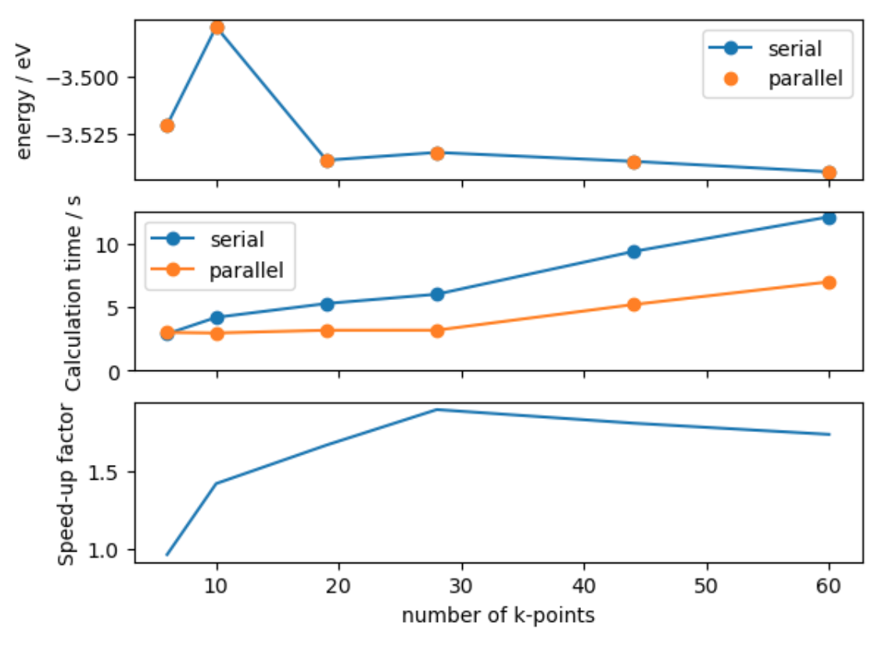

> ## Code connection
> In this chapter we explore [GPAW](https://wiki.fysik.dtu.dk/gpaw/) and [Quantum Espresso](https://www.quantum-espresso.org/), which are external electronic structure codes that can be used for parallel calculations in ASE.
{: .callout}

### GPAW includes a special Python interpreter for parallel calculations

- GPAW is a bit special! It is an electronic structure code implemented as a Python library with C backend.
- GPAW development is closely related to ASE development.
- The difference between GPAW and other external Python calculators is that it includes a special Python interpreter for parallel calculations.

### The workflow for single core GPAW calculations is the same as that for built-in calculators

- To begin with, we run a single-point energy calculation using Kohn-Sham density-functional theory (DFT).
- First, we import GPAW and create the atoms object

~~~
from gpaw import GPAW, PW

atoms = ase.build.bulk('Cu')
~~~
{: .python}

- Second, we attach GPAW as a calculator
- We specify a number of parameters:
    - `xc` sets the exchange-correlation functional
    - `kpts` sets the Brillouin-zone sampling
    - `mode` sets the basis set; in this case a 400 eV cutoff plane-wave basis is used.
- For more information about valid parameters, [see the GPAW docs](https://wiki.fysik.dtu.dk/gpaw/documentation/basic.html#parameters).
~~~
atoms.calc = GPAW(xc='PBE', kpts=(3, 3, 3), mode=PW(400))
~~~

- Finally, we run the calculation and get the result

~~~
energy = atoms.get_potential_energy()
~~~
{: .python}

~~~

  ___ ___ ___ _ _ _  
 |   |   |_  | | | | 
 | | | | | . | | | | 
 |__ |  _|___|_____|  22.8.0
 |___|_|             

User:   adam@Arctopus
Date:   Tue Apr  4 11:30:25 2023
Arch:   x86_64
Pid:    97252
CWD:    /home/adam/src/ase-tutorial-2023/development
Python: 3.10.0
gpaw:   /home/adam/.conda/envs/user-base/envs/ase-tutorials/lib/python3.10/site-packages/gpaw
_gpaw:  /home/adam/.conda/envs/user-base/envs/ase-tutorials/lib/python3.10/site-packages/
        _gpaw.cpython-310-x86_64-linux-gnu.so
ase:    /home/adam/src/ase/ase (version 3.23.0b1-70eab133b6)
numpy:  /home/adam/.conda/envs/user-base/envs/ase-tutorials/lib/python3.10/site-packages/numpy (version 1.23.5)
scipy:  /home/adam/.conda/envs/user-base/envs/ase-tutorials/lib/python3.10/site-packages/scipy (version 1.10.1)
libxc:  5.2.3
units:  Angstrom and eV
cores: 1
OpenMP: True
OMP_NUM_THREADS: 1

Input parameters:
  kpts: [3 3 3]
  mode: {ecut: 400.0,
         name: pw}
  xc: PBE

System changes: positions, numbers, cell, pbc, initial_charges, initial_magmoms 

Initialize ...
~~~
{: .output}

### It is important to check for convergence of the energy with respect to k-point sampling

- Using a `For` loop we can re-run the calculation for a increasing k-point mesh densities.
    - In this case we pass a dictionary specification that generates a mesh that is shifted off the Gamma-point.
    - We also use the `txt` keyword to direct output to a text file.
- We collect timing information to understand how increasing mesh density impacts calculation cost. 
    - The argument `str(k)` is the timer name
- The number of k-points is retrieved with `get_ibz_k_points()`. Note that `get_bz_k_points()` is not the correct function to use as this does not include reductions made due to system symmetry.

> ## Note
> This will take a few minutes to run: to see live output, open a terminal and use `tail -f kpts_serial.txt` to see this file grow. When it is finished, you can exit `tail` with ctrl-c.
{: .callout}

~~~
from ase.utils.timing import Timer

timer = Timer()
energies, times, nkpts = [], [], []

for k in range(3,9):

    atoms.calc = GPAW(mode=PW(400), xc='PBE',
                      kpts={'size': [k, k, k],
                            'gamma': False},
                      txt='kpts_serial.txt')
    timer.start(str(k))
    energies.append(atoms.get_potential_energy())
    timer.stop(str(k))
    times.append(timer.get_time(str(k)))
    nkpts.append(len(atoms.calc.get_ibz_k_points()))
~~~
{: .python}

~~~
Timing:                              incl.     excl.
-----------------------------------------------------------
Hamiltonian:                         0.096     0.000   0.0% |
 Atomic:                             0.088     0.001   0.0% |
  XC Correction:                     0.087     0.087   0.8% |
 Calculate atomic Hamiltonians:      0.001     0.001   0.0% |
 Communicate:                        0.000     0.000   0.0% |
 Initialize Hamiltonian:             0.000     0.000   0.0% |
 Poisson:                            0.000     0.000   0.0% |
 XC 3D grid:                         0.007     0.007   0.1% |
LCAO initialization:                 0.344     0.082   0.7% |
 LCAO eigensolver:                   0.147     0.000   0.0% |
  Calculate projections:             0.000     0.000   0.0% |
  DenseAtomicCorrection:             0.000     0.000   0.0% |
  Distribute overlap matrix:         0.000     0.000   0.0% |
  Orbital Layouts:                   0.001     0.001   0.0% |
  Potential matrix:                  0.144     0.144   1.3% ||
  Sum over cells:                    0.001     0.001   0.0% |
 LCAO to grid:                       0.018     0.018   0.2% |
 Set positions (LCAO WFS):           0.097     0.012   0.1% |
  Basic WFS set positions:           0.002     0.002   0.0% |
  Basis functions set positions:     0.000     0.000   0.0% |
  P tci:                             0.014     0.014   0.1% |
  ST tci:                            0.039     0.039   0.3% |
  mktci:                             0.030     0.030   0.3% |
PWDescriptor:                        0.017     0.017   0.2% |
SCF-cycle:                           1.907     0.101   0.9% |
 Davidson:                           0.459     0.152   1.3% ||
  Apply H:                           0.033     0.027   0.2% |
   HMM T:                            0.006     0.006   0.1% |
  Subspace diag:                     0.076     0.004   0.0% |
   calc_h_matrix:                    0.056     0.023   0.2% |
    Apply H:                         0.034     0.027   0.2% |
     HMM T:                          0.006     0.006   0.1% |
   diagonalize:                      0.009     0.009   0.1% |
   rotate_psi:                       0.006     0.006   0.1% |
  calc. matrices:                    0.160     0.091   0.8% |
   Apply H:                          0.069     0.056   0.5% |
    HMM T:                           0.012     0.012   0.1% |
  diagonalize:                       0.023     0.023   0.2% |
  rotate_psi:                        0.014     0.014   0.1% |
 Density:                            0.191     0.000   0.0% |
  Atomic density matrices:           0.019     0.019   0.2% |
  Mix:                               0.064     0.064   0.6% |
  Multipole moments:                 0.001     0.001   0.0% |
  Pseudo density:                    0.106     0.015   0.1% |
   Symmetrize density:               0.091     0.091   0.8% |
 Hamiltonian:                        1.152     0.004   0.0% |
  Atomic:                            0.952     0.015   0.1% |
   XC Correction:                    0.937     0.937   8.2% |--|
  Calculate atomic Hamiltonians:     0.006     0.006   0.1% |
  Communicate:                       0.000     0.000   0.0% |
  Poisson:                           0.002     0.002   0.0% |
  XC 3D grid:                        0.189     0.189   1.7% ||
 Orthonormalize:                     0.003     0.000   0.0% |
  calc_s_matrix:                     0.001     0.001   0.0% |
  inverse-cholesky:                  0.000     0.000   0.0% |
  projections:                       0.001     0.001   0.0% |
  rotate_psi_s:                      0.000     0.000   0.0% |
Set symmetry:                        0.025     0.025   0.2% |
Other:                               8.970     8.970  79.0% |-------------------------------|
-----------------------------------------------------------
Total:                                        11.359 100.0%

Memory usage: 390.56 MiB
Date: Tue Apr  4 11:30:36 2023
~~~
{: .output}

- Finally, we plot the results using a matplotlib figure with multiple subplots.

~~~
fig, axes = plt.subplots(nrows=2, sharex=True)
axes[0].plot(nkpts, energies, 'o-')
axes[0].set_ylabel('energy / eV') 
axes[1].plot(nkpts, times, 'o-')
axes[1].set_ylabel('Calculation time / s')
axes[1].set_ylim([0, None])
axes[1].set_xlabel('number of k-points')
~~~
{: .python}

- We find that the computational cost per k-point is roughly linear, but the energy convergence is relatively slow. 

~~~
change_in_energies = np.diff(energies) 
print(change_in_energies)
~~~
{: .python}

~~~
[ 0.04294983 -0.05835439  0.00339695 -0.00389174 -0.00460936]
~~~
{: .output}

### To accelerate our calculation we can parallelise the code over several cores

> ## Parallel programming systems
> There are several schemes for parallelising code. The two most common are [MPI](https://en.wikipedia.org/wiki/Message_Passing_Interface) and [OpenMP](https://en.wikipedia.org/wiki/OpenMP), with the optimum choice dependent on both the code and the hardware being used (for example, memory or CPU architecture, number of cores per node, network speed). Increasingly, electronic structure codes enable a hybrid of both approaches.
{: .callout}

- To split our code over several MPI processes we will use a special GPAW Python interpreter.
- We will use this to tun a script file named "kpts_parallel.py". This is very similar to the code above, except we will:
    - use the `parallel` keyword to switch on k-point parallelisation.
    - write a dictionary of the results to a json file.

### `parprint` and `paropen` are provided in ASE as an alternative to `print` and `open`

- Commands such as `print` or `open` can cause data corruption when multiple processes try to write to the same file. 
- `parprint` and `paropen` are provided in ASE to handle these common cases
- For other scenarios it may be necessary to use logic with `ase.parallel.world`. For more information see the relevant [GPAW docs](https://wiki.fysik.dtu.dk/gpaw/documentation/parallel_runs/parallel_runs.html) and [ASE docs](https://wiki.fysik.dtu.dk/ase/ase/parallel.html)

~~~
from gpaw import GPAW, PW

import ase.build
from ase.parallel import parprint, world, paropen
from ase.utils.timing import Timer
import json

atoms = ase.build.bulk('Cu')

timer = Timer()
energies, times, nkpts = [], [], []

for k in range(3, 9):

    atoms.calc = GPAW(mode=PW(400), xc='PBE',
                      kpts={'size': [k, k, k],
                            'gamma': False},
                      txt='kpts_parallel.txt',
                      parallel={'kpt': True})
    timer.start(str(k))
    energy = atoms.get_potential_energy()
    timer.stop(str(k))
    energies.append(energy)
    times.append(timer.get_time(str(k)))
    nkpts.append(len(atoms.calc.get_ibz_k_points()))

with paropen('parallel_results.json', 'w') as file:
    json.dump({'energies': energies,
               'times': times,
               'nkpts': nkpts},
              file)
~~~
{: .python}

- Now we are ready to run the script from the command-line.
- The `-P` option sets the number of MPI tasks, in this case 4.
- The parallel Python process essentially runs 4 copies of the script. (TODO: check this?)

~~~
gpaw -P 4 python kpts_parallel.py
~~~
{: .bash}

- Finally, we can plot the results.

~~~
import json

with open('parallel_results.json', 'r') as file:
    parallel_data = json.load(file)

fig, axes = plt.subplots(nrows=3, sharex=True)

axes[0].plot(nkpts, energies, 'o-', label='serial')
axes[0].plot(parallel_data['nkpts'], parallel_data['energies'], 'o', label='parallel')
axes[0].set_ylabel('energy / eV')
axes[0].legend()

axes[1].plot(nkpts, times, 'o-', label='serial')
axes[1].plot(parallel_data['nkpts'], parallel_data['times'], 'o-', label='parallel')
axes[1].set_ylabel('Calculation time / s')
axes[1].legend()
axes[1].set_ylim([0, None])

axes[2].plot(nkpts, np.asarray(times) / parallel_data['times'], label='4 cores')
axes[2].set_ylabel('Speed-up factor')
axes[2].set_xlabel('number of k-points')
~~~
{: .python}

- We find that the parallel calculation is faster, but not 4 times faster.
- This is because it is not possible to parallelise all parts of the code.

### Quantum Espresso is a suite of programs for electronic structure calculations 

- Here we use the `pw.x` program for DFT calculations with a plane-wave basis set and pseudopotentials.
- First we need to find our pseudopotentials library and pass this information to the Calculator. 
- In the virtual environment for these tutorials it can be found here:

~~~
from pathlib import Path
# Customise if necessary to espresso pseudopotential path
pseudo_dir = str(
    Path.home() / 'opt/espresso_sssp/SSSP_1.1.2_PBE_efficiency')
~~~
{: .python}

### Quantum Espresso can also be used for parallel programming with MPI

- Unlike GPAW, we are going to call the program with MPI from within our regular Python interpreter.
- We define the mpi command when instantiating the calculator: the command might need to be tweaked for different machines with different parallel environments. 
- This information is captured in a "Profile" object.

> ## Note  
> Profiles are a fairly new ASE feature and not yet used by all such Calculators. An alternative way to manage these commands is by setting environment variables, e.g. ASE_ESPRESSO_COMMAND. Check the docs for each calculator to see what is currently implemented.
{: .callout}

~~~
from ase.calculators.espresso import Espresso, EspressoProfile

profile = EspressoProfile(['mpirun', 'pw.x'])
~~~

### Each `Calculator` has its own keywords to match the input syntax of the corresponding software code

- You can see below that the keywords for the `Espresso()` class are different to those from the `GPAW()` class. 
- This is because each software code requires different input parameters. 
- For QE, the content of `input_data` contains the parameters for the calculation input file.

~~~
calc = Espresso(profile=profile,
                pseudo_dir=pseudo_dir,
                kpts=(3, 3, 3),
                input_data={'control':  {'tprnfor': True,
                                         'tstress': True},
                            'system': {'ecutwfc': 50.}},
                pseudopotentials={'Si': 'Si.pbe-n-rrkjus_psl.1.0.0.UPF'})
~~~
{: .python}

### Once we have setup the calculator we use the same three step process to retrieve a property

- The difficult part is setting up the calculator!
- Once setup is complete, we can get a total energy using the same three-step process.

~~~
atoms = ase.build.bulk('Si')
atoms.calc = calc
atoms.get_potential_energy()
~~~
{: .python}

~~~
-310.1328387367529
~~~
{: .output}

- As this is a file-based calculator we can inspect the input file automatically generated, `espresso.in`, and confirm that there is a straightforward relationship between the keys used for the `input_data` parameter and the espresso input. 

~~~
cat espresso.in
~~~

> ## Exercise: Basis set convergence
> As well as k-point sampling, basis-set convergence should be checked with respect to meaningful properties. 
> Check the convergence of the atomisation energy of Si with respect to the Espresso parameter `ecutwfc` - the basis set cutoff energy in Ry. 
> What cutoff energy is needed for a convergence level of 1 meV?
>
> Hint: to calculate the atomisation energy, you will need to compare the energy of the solid to a single atom in a large cell.
>
> Hint: you will need to calculate this property at several cutoff energies. Use Python functions and iteration constructs to avoid too much repetition.
{: .challenge}

