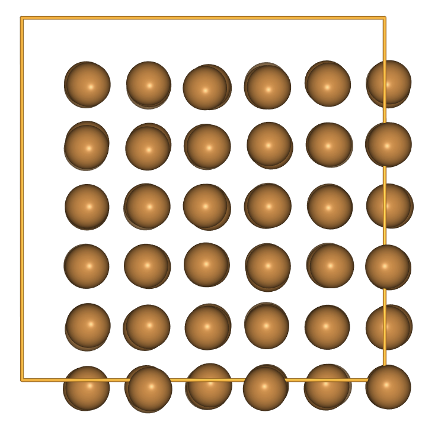
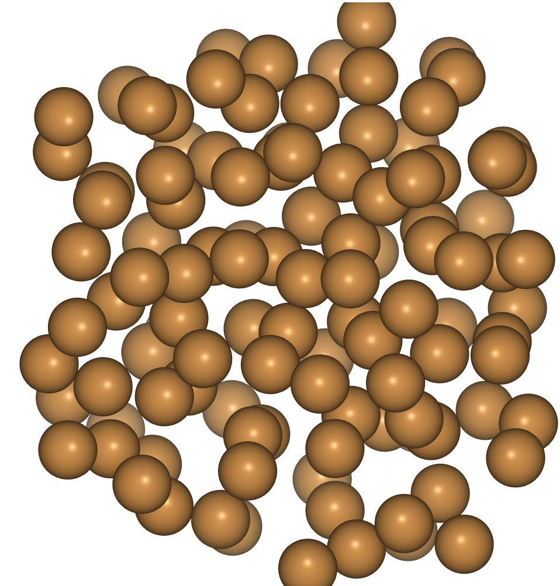

> ## Code connection
> In this episode we will use the `ase.md` module to perform molecular dynamics and simulated annealing.
{: .callout}

### Energies and forces can be used to update structures

- In the previous tutorials we created `Atoms` objects and used Calculators to get properties including energies and forces - but we didn't do very much with this information.
- A very useful thing to do with this information is to update our strucuture!
- ASE includes algorithms for molecular dynamics, geometry optimization and global optimization.
- It is a useful toolkit for experimentation and method-development in this area, or development of multi-step pipelines.

### Molecular dynamics methods are found in `ase.md`

> ## Note
> This is not a course in MD; be aware that thermostats and timesteps should be chosen with care for a given research problem.
{: .callout}

- Using the EMT potential, let us try some simulated annealing (controlled heating and cooling) of cubic Cu. 
- There are three preparation steps:
	- Build the structure
	- Attach a calculator 
	- Assign initial momenta.

~~~
import ase.build
from ase.calculators.emt import EMT
from ase.md.velocitydistribution import MaxwellBoltzmannDistribution

# Set up a crystal
cu_cube = ase.build.bulk('Cu', cubic=True) * [3, 3, 3]

# Describe the interatomic interactions with the Effective Medium Theory
cu_cube.calc = EMT()

# Set the momenta corresponding to T=300K
MaxwellBoltzmannDistribution(cu_cube, temperature_K=300)
~~~
{: .python}

### `Atoms` store forces, velocities and energies

~~~
row_limit = 4
print('velocities:')
print(cu_cube.get_velocities()[:row_limit])

print(f'\nkinetic energy: {cu_cube.get_kinetic_energy()}')
~~~
{: .python}

~~~
velocities:
[[ 0.04415792 -0.04196006 -0.02130616]
 [ 0.00674007 -0.009692    0.02499719]
 [ 0.00949497 -0.00967576  0.03271635]
 [ 0.01499601 -0.01203037 -0.02456846]]

kinetic energy: 5.209391647215017
~~~
{: .output}

- The initial forces should be very small due to symmetry

~~~
print('\nforces:')
print(cu_cube.get_forces()[:row_limit])
~~~
{: .python}

~~~
forces:
[[ 1.05748743e-14  9.68843061e-15  8.49667559e-15]
 [ 2.47839943e-14 -1.35655376e-15 -2.27769192e-15]
 [-1.81799020e-15  1.80896964e-14 -1.32012457e-15]
 [-2.18835366e-15  1.32706346e-16  1.38292156e-14]]
~~~
{: .output}

### Create a dynamics object and then attach `Atoms`

- Next the dynamics object is created and the `Atoms` are attached to it. 
- For constant-energy MD we can use the [Velocity Verlet method](https://wiki.fysik.dtu.dk/ase/ase/md.html#velocity-verlet-dynamics).
- While the default distance and energy units (Angstrom and eV) in ASE are fairly friendly, the related time unit is a bit awkward so we use a unit conversion from `ase.units` to set a timestep of 5 fs.

~~~
from ase import units
from ase.md.verlet import VelocityVerlet

dyn = VelocityVerlet(cu_cube, 5 * units.fs)
~~~
{: .python}

### After each timestep the `Atoms` properties are updated

- After one timestep, we see that the velocities have changes slightly and significant forces have appeared.

~~~
dyn.run(1)

print('velocities:')
print(cu_cube.get_velocities()[:row_limit])

print('\nforces:')
print(cu_cube.get_forces()[:row_limit])
~~~
{: .python}

~~~
velocities:
[[ 0.04342004 -0.04111118 -0.02074165]
 [ 0.00662474 -0.01022957  0.02452406]
 [ 0.00927404 -0.00939438  0.03250037]
 [ 0.01462945 -0.01201408 -0.02386139]]

forces:
[[-0.19094268  0.21966678  0.14607907]
 [-0.02984384 -0.13910846 -0.12243429]
 [-0.05717046  0.07281418 -0.05589085]
 [-0.09485569  0.00421554  0.18297141]]
~~~
{: .output}

- Now we run more timesteps, printing the kinetic and potential energy every 10 steps.

~~~
from ase import Atoms

def printenergy(atoms: Atoms) -> None:
    """Function to print the potential, kinetic and total energy"""
    epot = atoms.get_potential_energy() / len(atoms)
    ekin = atoms.get_kinetic_energy() / len(atoms)
    temperature = ekin / (1.5 * units.kB)
    
    print(f'Energy per atom: Epot = {epot:.3f}eV  Ekin = {ekin:.3f}eV '
          f'(T={temperature:3.0f}K)  Etot = {epot+ekin:.3f}eV')

# print starting energies
printenergy(cu_cube)
# print energies as system evolves
for i in range(20):
    dyn.run(10)
    printenergy(cu_cube)
~~~
{: .python}

~~~
Energy per atom: Epot = 0.028eV  Ekin = 0.015eV (T=115K)  Etot = 0.043eV
Energy per atom: Epot = 0.020eV  Ekin = 0.023eV (T=175K)  Etot = 0.043eV
Energy per atom: Epot = 0.019eV  Ekin = 0.024eV (T=186K)  Etot = 0.043eV
Energy per atom: Epot = 0.012eV  Ekin = 0.031eV (T=239K)  Etot = 0.043eV
Energy per atom: Epot = 0.020eV  Ekin = 0.022eV (T=174K)  Etot = 0.043eV
Energy per atom: Epot = 0.023eV  Ekin = 0.020eV (T=151K)  Etot = 0.043eV
Energy per atom: Epot = 0.013eV  Ekin = 0.029eV (T=228K)  Etot = 0.043eV
Energy per atom: Epot = 0.022eV  Ekin = 0.021eV (T=159K)  Etot = 0.043eV
Energy per atom: Epot = 0.016eV  Ekin = 0.027eV (T=206K)  Etot = 0.043eV
Energy per atom: Epot = 0.018eV  Ekin = 0.025eV (T=194K)  Etot = 0.043eV
Energy per atom: Epot = 0.021eV  Ekin = 0.022eV (T=169K)  Etot = 0.043eV
Energy per atom: Epot = 0.019eV  Ekin = 0.023eV (T=180K)  Etot = 0.043eV
Energy per atom: Epot = 0.011eV  Ekin = 0.032eV (T=245K)  Etot = 0.043eV
Energy per atom: Epot = 0.026eV  Ekin = 0.017eV (T=128K)  Etot = 0.043eV
Energy per atom: Epot = 0.016eV  Ekin = 0.027eV (T=209K)  Etot = 0.043eV
Energy per atom: Epot = 0.019eV  Ekin = 0.024eV (T=187K)  Etot = 0.043eV
Energy per atom: Epot = 0.017eV  Ekin = 0.026eV (T=202K)  Etot = 0.043eV
Energy per atom: Epot = 0.022eV  Ekin = 0.021eV (T=160K)  Etot = 0.043eV
Energy per atom: Epot = 0.016eV  Ekin = 0.027eV (T=210K)  Etot = 0.043eV
Energy per atom: Epot = 0.018eV  Ekin = 0.024eV (T=189K)  Etot = 0.043eV
~~~
{: .output}

> ## Discussion
> As the system equilibrates, energy is conserved but the temperature is about half of the original setting. Why?
> > ## Solution
> > We started with _momenta_ corresponding to 300K, but ideal lattice _positions_ which correspond to 0K (in classical dynamics). The [equipartition theorem](https://en.wikipedia.org/wiki/Equipartition_theorem) states that energy should be shared equally, so half of the kinetic energy makes its way into potential energy and we are left with the momentum distribution of a lower temperature.
> {: .solution}
{: .challenge}

### Attach an observer function to track properties

- It's a bit inconvenient to write a loop that stops and starts the MD as above; instead we can attach an "observer" function.

~~~
def energy_observer():
    printenergy(cu_cube)
    
dyn.attach(energy_observer, interval=10)
dyn.run(100)
~~~

> ## Exercise: RMS displacement
> Use an observer to measure the average root-mean-square displacement of Cu atoms at 300K.
>
> Hint: if the numbers seem too large, try visualising the trajectory to see what could be causing a problem.
>
> > ## Solution
> > ~~~
> > import numpy as np
> > ref_atoms = ase.build.bulk('Cu', cubic=True) * [3, 3, 3]
> > ref_atoms.center()  # Shift centre-of-mass to the origin
> >
> > def rms_observer():
> >     cu_cube.center()  # Remove drift, make consistent with ref
> >     displacements = cu_cube.positions - ref_atoms.positions
> >     rms_displacements = np.sqrt((displacements**2).mean(axis=0))
> >     print(rms_displacements)
> >
> > dyn = VelocityVerlet(cu_cube, 5 * units.fs)
> > dyn.attach(rms_observer, interval=50)
> > dyn.run(400)
> > ~~~
> > {: .python}
> {: .solution}
{: .challenge}

### Attach a `Trajectory` object to track atom positions

- At modest temperature and under periodic boundary conditions, the atoms have not moved very far. 

~~~
from ase.visualize import view

view(cu_cube, viewer='ngl')
~~~
{: .python}

- Let's try something more extreme: 
	- remove the boundary conditions
	- increase the temperature
	- regulate the temperature with a Langevin thermostat
- We attach a Trajectory to track atom positions
- This simulation will take a few minutes to run.

~~~
from ase.io.trajectory import Trajectory
from ase.md import Langevin

cu_lump = cu_cube.copy()
cu_lump.pbc=False
cu_lump.calc = EMT()

def energy_observer():
    printenergy(cu_lump)

dyn = Langevin(cu_lump, 5 * units.fs, friction=0.005, temperature_K=1000)
dyn.attach(energy_observer, interval=50)

# We also want to save the positions of all atoms after every 50th time step.
traj = Trajectory('cu_melt.traj', 'w', cu_lump)
dyn.attach(traj.write, interval=50)

# Now run the dynamics
dyn.run(1000)
~~~
{: .python}

~~~
Energy per atom: Epot = 0.458eV  Ekin = 0.025eV (T=193K)  Etot = 0.483eV
Energy per atom: Epot = 0.463eV  Ekin = 0.042eV (T=322K)  Etot = 0.504eV
Energy per atom: Epot = 0.477eV  Ekin = 0.048eV (T=372K)  Etot = 0.525eV
Energy per atom: Epot = 0.496eV  Ekin = 0.058eV (T=452K)  Etot = 0.554eV
Energy per atom: Epot = 0.493eV  Ekin = 0.070eV (T=539K)  Etot = 0.562eV
Energy per atom: Epot = 0.504eV  Ekin = 0.076eV (T=587K)  Etot = 0.580eV
Energy per atom: Epot = 0.507eV  Ekin = 0.085eV (T=661K)  Etot = 0.592eV
Energy per atom: Epot = 0.518eV  Ekin = 0.080eV (T=617K)  Etot = 0.598eV
Energy per atom: Epot = 0.511eV  Ekin = 0.095eV (T=732K)  Etot = 0.606eV
Energy per atom: Epot = 0.526eV  Ekin = 0.090eV (T=694K)  Etot = 0.616eV
Energy per atom: Epot = 0.517eV  Ekin = 0.106eV (T=821K)  Etot = 0.623eV
Energy per atom: Epot = 0.543eV  Ekin = 0.099eV (T=763K)  Etot = 0.642eV
Energy per atom: Epot = 0.551eV  Ekin = 0.094eV (T=724K)  Etot = 0.644eV
Energy per atom: Epot = 0.539eV  Ekin = 0.110eV (T=854K)  Etot = 0.650eV
Energy per atom: Epot = 0.541eV  Ekin = 0.124eV (T=959K)  Etot = 0.665eV
Energy per atom: Epot = 0.551eV  Ekin = 0.112eV (T=863K)  Etot = 0.663eV
Energy per atom: Epot = 0.568eV  Ekin = 0.099eV (T=768K)  Etot = 0.667eV
Energy per atom: Epot = 0.555eV  Ekin = 0.121eV (T=938K)  Etot = 0.676eV
Energy per atom: Epot = 0.574eV  Ekin = 0.101eV (T=782K)  Etot = 0.675eV
Energy per atom: Epot = 0.578eV  Ekin = 0.102eV (T=791K)  Etot = 0.680eV
Energy per atom: Epot = 0.590eV  Ekin = 0.101eV (T=782K)  Etot = 0.691eV
~~~
{: .output}

- The trajectory file lets us visualise what happened.

~~~
import ase.io

frames = ase.io.read('cu_melt.traj', index=':')
view(frames, viewer='ngl')
~~~
{: .python}

### To quench, reduce the target temperature over the course of the simulation

- We see that as the temperature falls some order returns to the structure.

~~~
for temperature in range(800, 100, -50):
    dyn.set_temperature(temperature_K=temperature)
    dyn.run(100)

frames = ase.io.read('cu_melt.traj', index=':')
view(frames, viewer='ngl')
~~~
{: .python}

### extras

in the attached archive you will find some fully worked examples of LJonesium NVE, NVT and NPT. Also a simple example of how to do a dynamic NEB optimisation for a small molecule. 
