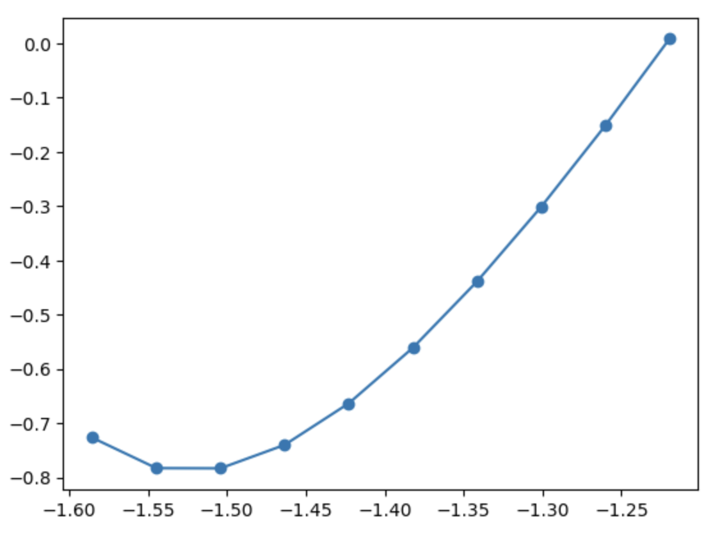

> ## Code connection
> In this episode we will use the `ase.optimize` module to perform geometry optimisation, and `ase.constraints` to constrain or optimise various degrees of freedom.
{: .callout}

### To minimise energy and forces we typically use an optimisation algorithm

- With a zero temperature thermostat we would eventually expect the structure to reach some local minimum energy in the potential-energy surface. 
- Generally it is more efficient to achieve this by a dedicated "geometry optimisation" algorithm that seeks to minimise energy and forces.
- Let's grab a molecular structure and apply a semi-empirical potential to calculate forces.

~~~
from ase.calculators.mopac import MOPAC

atoms = ase.build.molecule('CH3CH2OH')
atoms.calc = MOPAC()
atoms.get_forces()
~~~
{: .python}

~~~

          MOPAC Job: "mopac.mop" ended normally on Apr 17, 2023, at 11:15.

array([[ 0.05314722, -0.14217078,  0.        ],
       [ 0.08516519,  0.2916233 ,  0.        ],
       [ 0.46667555,  0.31685049,  0.        ],
       [-0.30313837, -0.04753196,  0.        ],
       [-0.29917533,  0.04623103,  0.23729349],
       [-0.2992056 ,  0.04519975, -0.23729349],
       [ 0.11622196, -0.06459161,  0.        ],
       [ 0.09013888, -0.22333767,  0.08025091],
       [ 0.09017054, -0.22227256, -0.08025091]])
~~~
{: .output}

### There are a range of algorthms in the `ase.optimize` module

- We can see from the forces that this potential does not quite agree with the structure from the G2 database. 
- For further calculations using MOPAC we need to find the local minimum. 
- ASE provides a range of algorthms in the ase.optimize module.
- There are three preparation steps:
    - Build the `Atoms` structure
    - Attach a `Calculator` object
    - Instantiate the optimisation object with the `Atoms` object

~~~
from ase.optimize import GPMin
# To avoid that "ended normally" message on every step, we
# tweak the command a bit
atoms = ase.build.molecule('CH3CH2OH')
atoms.calc = MOPAC(command='mopac PREFIX.mop 1> /dev/null')
opt = GPMin(atoms)
~~~
{: .python}

- When we run the optimisation the original `Atoms` object updates its  positions.
 
~~~
opt.run(fmax=1e-3)
atoms.get_forces()
~~~
{: .python}

~~~
       Step     Time          Energy          fmax
GPMin:    0 11:15:28       -2.385274         0.564075
GPMin:    1 11:15:28       -2.392905         1.033572
GPMin:    2 11:15:28       -2.403956         0.742120
GPMin:    3 11:15:28       -2.420694         0.221260
GPMin:    4 11:15:28       -2.421733         0.151170
GPMin:    5 11:15:28       -2.422788         0.015994
GPMin:    6 11:15:28       -2.422797         0.010651
GPMin:    7 11:15:28       -2.422799         0.006327
GPMin:    8 11:15:28       -2.422801         0.003863
GPMin:    9 11:15:28       -2.422801         0.000485

array([[ 7.17242279e-05,  1.52121276e-04, -2.75015147e-04],
       [ 2.59490798e-04,  9.01106079e-05,  4.03286166e-06],
       [-4.31949839e-04, -1.41150158e-04,  1.70377564e-04],
       [ 1.22850506e-04, -3.39324113e-04,  3.42142780e-05],
       [-6.14902993e-05,  4.04153448e-05, -5.03023605e-05],
       [-1.96786304e-04, -1.73499780e-04, -1.32824250e-04],
       [ 1.40066056e-05,  1.05244680e-04,  2.27704910e-04],
       [-3.03548727e-05, -6.07097455e-05,  8.32590795e-06],
       [ 2.52552541e-04,  3.26878615e-04,  1.34862363e-05]])
~~~
{: .output}

> ## Exercise: Comparing optimisers
> Compare the results and performance of QuasiNewton, FIRE and GPMin optimizers for a few small organic molecules.
{: .challenge}

### We can apply constraints to the `Atoms` object before optimisation

- We don't always want to optimize every degree of freedom; perhaps we can assume some region is rigid, or we are using a forcefield that fixes some bond length. 
- In ASE this is achieved by applying constraints to the Atoms object before optimisation.
- Suppose we want to explore the effect of stretching the C-C bond in ethane, while allowing the hydrogen atoms to relax to their local minimum at each configuration.
- The steps are largely the same as in the previous calculation
    - Build the `Atoms` structure (`build_stretched_ethane`)
    - Apply a constraint (`build_stretched_ethane`)
    - Attach a calculator (`get_optimised_energy`)
    - Create an optimisation object (`get_optimised_energy`)
    - Run the optimisation routine (`get_optimised_energy`)
- Python list comprehension is used to repeat the process for various C-C bond lengths

~~~
from ase.constraints import FixAtoms
import numpy as np

ethane = ase.build.molecule('C2H6')
g2_c_c = ethane.positions[1, 2] - ethane.positions[0, 2]
constraint = FixAtoms(mask=(atoms.symbols == 'C'))

def build_stretched_ethane(d: float = g2_c_c) -> Atoms:
    shift = (d - g2_c_c) / 2
    ethane = ase.build.molecule('C2H6')
    ethane.positions[[0, 2, 3, 4]] += [0, 0, shift]
    ethane.positions[[1, 5, 6, 7]] -= [0, 0, shift]
    ethane.set_constraint(constraint)
    return ethane

def get_optimised_energy(atoms: Atoms) -> float:
    # Redirect STDOUT to avoid annoying message on every step
    atoms.calc = MOPAC(command='mopac PREFIX.mop 1> /dev/null')
    opt = GPMin(atoms)
    opt.run(fmax=1e-3)
    return atoms.get_potential_energy()

lengths = np.linspace(0.8, 1.04, 10) * g2_c_c
energies = [get_optimised_energy(build_stretched_ethane(d)) for d in lengths]
~~~
{: .python}

~~~
Step     Time          Energy          fmax
GPMin:    0 11:15:29        0.208544         0.693187
GPMin:    1 11:15:29        0.010296         0.115406
GPMin:    2 11:15:29        0.008034         0.024697
GPMin:    3 11:15:29        0.007877         0.011408
GPMin:    4 11:15:29        0.007868         0.001131
GPMin:    5 11:15:29        0.007871         0.000784
       Step     Time          Energy          fmax
GPMin:    0 11:15:29        0.004891         0.621748
GPMin:    1 11:15:29       -0.148598         0.110453
GPMin:    2 11:15:29       -0.151673         0.029460
GPMin:    3 11:15:29       -0.151831         0.010914
GPMin:    4 11:15:29       -0.151840         0.001365
GPMin:    5 11:15:30       -0.151837         0.000968
       Step     Time          Energy          fmax
GPMin:    0 11:15:30       -0.185557         0.542410
GPMin:    1 11:15:30       -0.297151         0.110753
GPMin:    2 11:15:30       -0.301405         0.033660
GPMin:    3 11:15:30       -0.301558         0.011636
GPMin:    4 11:15:30       -0.301564         0.006232
GPMin:    5 11:15:30       -0.301566         0.001605
GPMin:    6 11:15:30       -0.301564         0.000377
       Step     Time          Energy          fmax
GPMin:    0 11:15:30       -0.359554         0.454383
GPMin:    1 11:15:30       -0.433351         0.115860
GPMin:    2 11:15:30       -0.438910         0.036632
GPMin:    3 11:15:30       -0.439056         0.011921
GPMin:    4 11:15:30       -0.439063         0.001158
GPMin:    5 11:15:30       -0.439061         0.000215
       Step     Time          Energy          fmax
GPMin:    0 11:15:30       -0.512800         0.356939
GPMin:    1 11:15:30       -0.554601         0.120804
GPMin:    2 11:15:30       -0.561024         0.037269
GPMin:    3 11:15:30       -0.561161         0.009839
GPMin:    4 11:15:30       -0.561165         0.001118
GPMin:    5 11:15:31       -0.561165         0.000591
       Step     Time          Energy          fmax
GPMin:    0 11:15:31       -0.639633         0.249621
GPMin:    1 11:15:31       -0.657675         0.114301
GPMin:    2 11:15:31       -0.663367         0.034829
GPMin:    3 11:15:31       -0.663479         0.006902
GPMin:    4 11:15:31       -0.663481         0.001379
GPMin:    5 11:15:31       -0.663481         0.000663
       Step     Time          Energy          fmax
GPMin:    0 11:15:31       -0.732713         0.133629
GPMin:    1 11:15:31       -0.738455         0.063419
GPMin:    2 11:15:31       -0.740055         0.018883
GPMin:    3 11:15:31       -0.740080         0.007060
GPMin:    4 11:15:31       -0.740082         0.000661
       Step     Time          Energy          fmax
GPMin:    0 11:15:31       -0.782718         0.048157
GPMin:    1 11:15:31       -0.783098         0.022657
GPMin:    2 11:15:31       -0.783185         0.003206
GPMin:    3 11:15:31       -0.783185         0.000318
       Step     Time          Energy          fmax
GPMin:    0 11:15:31       -0.778047         0.160836
GPMin:    1 11:15:31       -0.782210         0.063283
GPMin:    2 11:15:31       -0.782847         0.007287
GPMin:    3 11:15:31       -0.782853         0.000394
       Step     Time          Energy          fmax
GPMin:    0 11:15:31       -0.704544         0.316270
GPMin:    1 11:15:31       -0.706982         0.214952
GPMin:    2 11:15:31       -0.726086         0.073858
GPMin:    3 11:15:31       -0.726699         0.006312
GPMin:    4 11:15:31       -0.726703         0.001655
GPMin:    5 11:15:31       -0.726703         0.000322
~~~
{: .output}

~~~
%matplotlib inline
import matplotlib.pyplot as plt
plt.plot(lengths, energies, 'o-')
~~~
{: .python}

### Filters can be used to optimise other degrees of freedom

- By default the geometry optimization only considers the atomic positions. 
- To present other degrees of freedom, ASE includes "filters" that present them to the optimizer.
- Suppose we want to find the minimum-energy Si lattice parameters for a GAP machine-learned potential.
- First lets set up the `Atoms` object and attach the calculator

> ## Note
> More information on the Quippy `Potential` object for GAP can be found in the [External Calculators](https://ase-workshop-2023.github.io/tutorial/07-external-calculators) episode.
{: .callout}

~~~
from ase.constraints import StrainFilter

from pathlib import Path
from quippy.potential import Potential

gap = Potential(param_filename=str(Path.cwd() / 'Si_PRX_GAP/gp_iter6_sparse9k.xml'))
si = ase.build.bulk('Si', cubic=True)
si.calc = gap
~~~
{: .python}

### Filters place different information into the `Atoms` properties interface

- The filter presents a similar interface to Atoms, but "cheats" and puts different information into the positions data.
- In this case `position` is the a strain relative to the initial unit cell, and stresses are remapped to `forces`.

~~~
si_strain = StrainFilter(si)
print(si_strain.get_positions())
print(si_strain.get_forces())
~~~
{: .python}

~~~
array([[0., 0., 0.],
       [0., 0., 0.]])

array([[ 1.55837119e+00,  1.55837119e+00,  1.55837119e+00],
       [ 7.06032455e-16, -6.41847686e-17, -8.67361738e-18]])
~~~
{: .python}

- To get a Si lattice with very low stress we run the optimisation with the filter as the `Atoms` object:

~~~
from ase.optimize import QuasiNewton
opt = QuasiNewton(si_strain)
opt.run(fmax=1e-4)

print(f"Lattice parameter: {si.cell.lengths()[0]}")
print("Residual stress:")
print(si.get_stress())
~~~
{: .python}

~~~
                Step[ FC]     Time          Energy          fmax
*Force-consistent energies used in optimization.
BFGSLineSearch:    0[  0] 11:15:35    -1305.407858*       2.6992
BFGSLineSearch:    1[  2] 11:15:36    -1305.420818*       0.3445
BFGSLineSearch:    2[  3] 11:15:36    -1305.421038*       0.0080
BFGSLineSearch:    3[  4] 11:15:36    -1305.421038*       0.0000

Lattice parameter: 5.460914996056226
Residual stress:
[-8.62027513e-08 -8.62027472e-08 -8.62027630e-08 -2.58637937e-15
 -6.90550987e-15 -4.46639070e-15]
~~~
{: .python}

- We can optimise the lattice vectors and positions at the same time using a [UnitCellFilter](https://wiki.fysik.dtu.dk/ase/ase/constraints.html#the-unitcellfilter-class) or the more sophisticated [ExpCellFilter](https://wiki.fysik.dtu.dk/ase/ase/constraints.html#the-expcellfilter-class).

### MD and geometry optimization can be combined to find glassy local-minimum phases

- Let's generate an amorphous Si cell by i) stretching a supercell and running a few steps of high-temperature MD; ii) performing a local optimisation to find a glassy local-minimum phase.
- Step i) is a similar process to the Cu calculation in the [previous episode](https://ase-workshop-2023.github.io/tutorial/10-dynamics/), but now we are keeping the periodic boundary and using a machine-learned potential. 
- It should take a few minutes to run.

~~~
def printenergy(atoms: Atoms) -> None:
    """Function to print the potential, kinetic and total energy"""
    epot = atoms.get_potential_energy() / len(atoms)
    ekin = atoms.get_kinetic_energy() / len(atoms)
    temperature = ekin / (1.5 * units.kB)
    
    print(f'Energy per atom: Epot = {epot:.3f}eV  Ekin = {ekin:.3f}eV '
          f'(T={temperature:3.0f}K)  Etot = {epot+ekin:.3f}eV')

def energy_observer():
    printenergy(si)

si = ase.build.bulk('Si', cubic=True) * [2, 2, 2]
si.set_cell(si.cell * 1.2, scale_atoms=True)
si.calc = gap
si.calc.name = 'Si melt'

MaxwellBoltzmannDistribution(si, temperature_K=3000)
dyn = Langevin(si, 5 * ase.units.fs, friction=0.002, temperature_K=3000)
dyn.attach(energy_observer, interval=20)
traj = Trajectory('si_melt.traj', 'w', si)
dyn.attach(traj.write, interval=20)
dyn.run(400)
~~~
{: .python}

~~~
Energy per atom: Epot = 0.457eV  Ekin = 0.055eV (T=423K)  Etot = 0.512eV
Energy per atom: Epot = 0.457eV  Ekin = 0.055eV (T=423K)  Etot = 0.512eV
Energy per atom: Epot = 0.457eV  Ekin = 0.055eV (T=423K)  Etot = 0.512eV
Energy per atom: Epot = 0.457eV  Ekin = 0.055eV (T=423K)  Etot = 0.512eV
Energy per atom: Epot = 0.457eV  Ekin = 0.055eV (T=423K)  Etot = 0.512eV
Energy per atom: Epot = 0.457eV  Ekin = 0.055eV (T=423K)  Etot = 0.512eV
Energy per atom: Epot = 0.457eV  Ekin = 0.055eV (T=423K)  Etot = 0.512eV
Energy per atom: Epot = 0.457eV  Ekin = 0.055eV (T=423K)  Etot = 0.512eV
Energy per atom: Epot = 0.457eV  Ekin = 0.055eV (T=423K)  Etot = 0.512eV
Energy per atom: Epot = 0.457eV  Ekin = 0.055eV (T=423K)  Etot = 0.512eV
Energy per atom: Epot = 0.457eV  Ekin = 0.055eV (T=423K)  Etot = 0.512eV
Energy per atom: Epot = 0.457eV  Ekin = 0.055eV (T=423K)  Etot = 0.512eV
Energy per atom: Epot = 0.457eV  Ekin = 0.055eV (T=423K)  Etot = 0.512eV
Energy per atom: Epot = 0.457eV  Ekin = 0.055eV (T=423K)  Etot = 0.512eV
Energy per atom: Epot = 0.457eV  Ekin = 0.055eV (T=423K)  Etot = 0.512eV
Energy per atom: Epot = 0.457eV  Ekin = 0.055eV (T=423K)  Etot = 0.512eV
Energy per atom: Epot = 0.457eV  Ekin = 0.055eV (T=423K)  Etot = 0.512eV
Energy per atom: Epot = 0.457eV  Ekin = 0.055eV (T=423K)  Etot = 0.512eV
Energy per atom: Epot = 0.457eV  Ekin = 0.055eV (T=423K)  Etot = 0.512eV
Energy per atom: Epot = 0.457eV  Ekin = 0.055eV (T=423K)  Etot = 0.512eV
Energy per atom: Epot = 0.457eV  Ekin = 0.055eV (T=423K)  Etot = 0.512eV
~~~
{: .output}

- We now optimise lattice vectors and atom positions using the `ExpCellFilter`.

> ## Discussion
> Note that the trajectory writer is directed to the original Si Atoms object, not the filtered version. Why?.

~~~
from ase.constraints import ExpCellFilter
si_expcell = ExpCellFilter(si)
opt = QuasiNewton(si_expcell)
traj = Trajectory('si_glass.traj', 'w', si)
opt.attach(traj)
opt.run(fmax=1e-3)
~~~
{: .python}

~~~
Step[ FC]     Time          Energy          fmax
*Force-consistent energies used in optimization.
BFGSLineSearch:    0[  0] 11:23:00   -10438.560479*       0.0082
BFGSLineSearch:    1[  2] 11:23:02   -10438.560479*       0.0083
BFGSLineSearch:    2[  4] 11:23:05   -10438.560479*       0.0021
BFGSLineSearch:    3[  6] 11:23:07   -10438.560479*       0.0130
BFGSLineSearch:    4[  8] 11:23:10   -10438.560479*       0.0008
~~~
{: .output}

- We can confirm that the forces and stresses are low, so we should be in a local minimum.

~~~
print("Max force:")
print(np.linalg.norm(si.get_forces(), axis=1).max())

print("Stress:")
print(si.get_stress())
~~~
{: .python}

~~~
Max force:
0.000764832698961055
Stress:
[ 1.17734167e-07  5.24076825e-08 -1.70158721e-07 -1.69164613e-08
 -3.43769568e-08 -9.34363441e-09]
~~~
{: .output}

> ## Exercise: Comparing crystal and amorphous Si
> Compare the energy and lattice vectors of the amorphous and crystalline Si.
{: .challenge}

> ## Exercise: Fixing the symmetry
> A very useful constraint is the [FixSymmetry](https://wiki.fysik.dtu.dk/ase/ase/constraints.html#the-fixsymmetry-class) class.
> Find a geometry file for a high-symmetry crystal structure. With a Calculator of your choice, perform a geometry optimization of the lattice vectors and atomic positions while fixing the symmetry.
> If compute power allows, you may choose to use DFT. If using Quantum Espresso, you may find it helpful to look at the SocketIOCalculator setup in the [extra content section](../13-extras/index.html).
{: .challenge}

